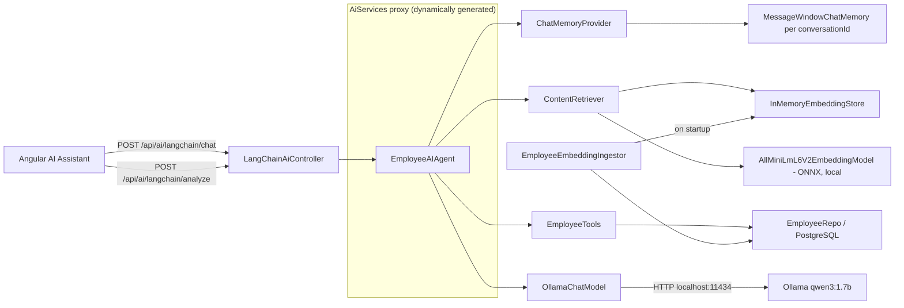
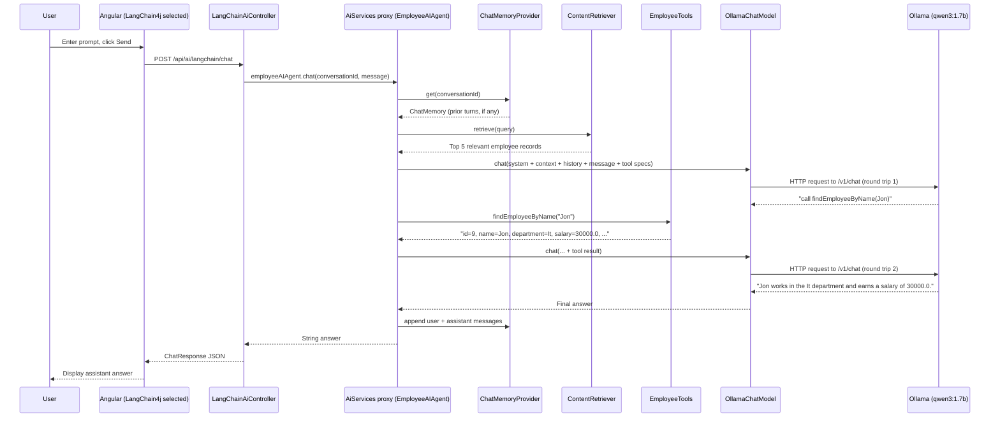

# LangChain4j Integration Guide

## 1. Overview

This document explains the LangChain4j integration inside the Employee CRUD application.
The implementation uses LangChain4j `1.0.0` (core) with the Ollama integration and
in-process embedding model pinned at `1.0.0-beta5` (the latest version available for those
modules), on Spring Boot `4.1.0` and Java 21.

The module is fully isolated under:

```text
src/main/java/com/practices/ai/langchain4j
```

It **does not modify** the existing Spring AI integration (`com.practices.ai`) or any
Employee CRUD controller. Both AI stacks coexist in the same application and can be called
independently:

| Stack | Base path | Status |
|---|---|---|
| Spring AI | `/api/ai/*` | Unchanged, still the default UI path |
| LangChain4j | `/api/ai/langchain/*` | New, additive |

Both ultimately talk to the same local Ollama server (`qwen3:1.7b`), but through two
different Java libraries with two different orchestration models.

## 2. Why a second AI stack

Spring AI's integration in this project (see `doc/spring_ai.md`) is a straightforward
"render a prompt template, call `ChatClient`" flow. It does not call tools, does not run
retrieval, and returns plain text.

LangChain4j was added specifically to demonstrate the features Spring AI's integration here
does not use:

- **AI Services** - interface-driven agents instead of manual prompt building.
- **Chat Memory** - a dedicated per-conversation memory abstraction, independent of the
  Spring AI `ConversationMemory`.
- **Tools** - letting the model call real Java methods (backed by `EmployeeRepo`) instead of
  only reading static prompt context.
- **Retrieval-Augmented Generation (RAG)** - embedding employee records into a vector store
  and retrieving the most relevant ones per question.
- **Embeddings** - a self-contained, in-process embedding model (no external server, no
  extra Ollama model pull).
- **Output Parsers** - returning structured Java records instead of raw strings.

## 3. High-level architecture



## 4. Package structure

```text
com.practices.ai.langchain4j
├── agent/
│   └── EmployeeAIAgent.java            AI Service interface
├── config/
│   └── LangChain4jConfiguration.java   All LangChain4j beans, isolated from Spring AI config
├── controller/
│   ├── LangChainAiController.java      /api/ai/langchain/* endpoints
│   └── LangChainAiExceptionHandler.java Scoped exception handling
├── dto/
│   ├── EmployeeAnswer.java             Structured output-parser target
│   └── EmployeeAnalysisResponse.java   Wraps EmployeeAnswer with metadata
├── retrieval/
│   └── EmployeeEmbeddingIngestor.java  Embeds employee rows into the vector store
└── tools/
    └── EmployeeTools.java              @Tool methods backed by EmployeeRepo
```

Prompt template resource:

```text
src/main/resources/langchain4j/employee-agent-system.txt
```

## 5. Maven configuration

LangChain4j ships a BOM the same way Spring AI does:

```xml
<properties>
    <langchain4j.version>1.0.0</langchain4j.version>
</properties>

<dependencyManagement>
    <dependencies>
        <dependency>
            <groupId>dev.langchain4j</groupId>
            <artifactId>langchain4j-bom</artifactId>
            <version>${langchain4j.version}</version>
            <type>pom</type>
            <scope>import</scope>
        </dependency>
    </dependencies>
</dependencyManagement>
```

Dependencies (no explicit versions - the BOM manages them):

```xml
<dependency>
    <groupId>dev.langchain4j</groupId>
    <artifactId>langchain4j</artifactId>
</dependency>
<dependency>
    <groupId>dev.langchain4j</groupId>
    <artifactId>langchain4j-ollama</artifactId>
</dependency>
<dependency>
    <groupId>dev.langchain4j</groupId>
    <artifactId>langchain4j-embeddings-all-minilm-l6-v2</artifactId>
</dependency>
```

The BOM (`langchain4j-bom:1.0.0`) pins `langchain4j-ollama` and
`langchain4j-embeddings-all-minilm-l6-v2` to `1.0.0-beta5` - the integration modules had not
yet been promoted to a `1.0.0` stable release at the time of writing. This was confirmed by
inspecting the BOM's own `<dependencyManagement>` rather than assumed.

## 6. `LangChain4jConfiguration`

File:

```text
src/main/java/com/practices/ai/langchain4j/config/LangChain4jConfiguration.java
```

This single `@Configuration` class wires every LangChain4j bean. It is intentionally kept
separate from `com.practices.ai.config.AIConfig` / `AiConfiguration` (Spring AI's config
classes) so the two stacks never share bean definitions.

### 6.1 Chat model

```java
@Bean
ChatModel langchain4jChatModel(Map<String, ProviderConfig> aiProviders) {
    ProviderConfig ollama = aiProviders.get("ollama");
    String baseUrl = ollama != null && ollama.baseUrl() != null && !ollama.baseUrl().isBlank()
            ? ollama.baseUrl() : DEFAULT_BASE_URL;
    String modelName = ollama != null && !ollama.models().isEmpty() ? ollama.models().get(0) : DEFAULT_MODEL;
    Duration timeout = ollama != null && ollama.timeout() != null ? ollama.timeout() : DEFAULT_TIMEOUT;

    return OllamaChatModel.builder()
            .baseUrl(baseUrl)
            .modelName(modelName)
            .timeout(timeout)
            .build();
}
```

It reuses the **same** `Map<String, ProviderConfig> aiProviders` bean that Spring AI's
`AiHealthService` and `AiModelService` were fixed to use (see `doc/spring_ai.md` §6-7 and the
`app.ai.providers.ollama.*` properties). This means base URL, model name, and timeout are
configured once, in one place, for both stacks.

### 6.2 Embedding model

```java
@Bean
EmbeddingModel langchain4jEmbeddingModel() {
    return new AllMiniLmL6V2EmbeddingModel();
}
```

`AllMiniLmL6V2EmbeddingModel` runs **in-process** using ONNX Runtime - no network call, no
separate Ollama embedding model to pull. The model file ships inside the
`langchain4j-embeddings-all-minilm-l6-v2` jar. The first time it initializes, the JVM logs
warnings about restricted native access (`ai.onnxruntime.OnnxRuntime`) - this is expected and
harmless.

### 6.3 Embedding store and retriever

```java
@Bean
EmbeddingStore<TextSegment> employeeEmbeddingStore() {
    return new InMemoryEmbeddingStore<>();
}

@Bean
ContentRetriever employeeContentRetriever(
        EmbeddingStore<TextSegment> employeeEmbeddingStore, EmbeddingModel langchain4jEmbeddingModel) {
    return EmbeddingStoreContentRetriever.builder()
            .embeddingStore(employeeEmbeddingStore)
            .embeddingModel(langchain4jEmbeddingModel)
            .maxResults(5)
            .minScore(0.0)
            .build();
}
```

Every request the agent handles automatically retrieves the top 5 most relevant employee
records and prepends them as context - this is the RAG/Retrieval piece.

### 6.4 Chat memory

```java
@Bean
ChatMemoryProvider employeeChatMemoryProvider() {
    Map<Object, ChatMemory> memories = new ConcurrentHashMap<>();
    return memoryId -> memories.computeIfAbsent(memoryId,
            id -> MessageWindowChatMemory.builder().id(id).maxMessages(20).build());
}
```

Each `conversationId` gets its own independent `MessageWindowChatMemory` capped at 20
messages, cached in a `ConcurrentHashMap` so repeated calls with the same ID reuse the same
memory instance instead of starting fresh every time.

### 6.5 The agent bean

```java
@Bean
EmployeeAIAgent employeeAIAgent(
        ChatModel langchain4jChatModel,
        ChatMemoryProvider employeeChatMemoryProvider,
        ContentRetriever employeeContentRetriever,
        EmployeeTools employeeTools) {
    return AiServices.builder(EmployeeAIAgent.class)
            .chatModel(langchain4jChatModel)
            .chatMemoryProvider(employeeChatMemoryProvider)
            .contentRetriever(employeeContentRetriever)
            .tools(employeeTools)
            .build();
}
```

`AiServices.builder(...)` generates a runtime proxy implementing `EmployeeAIAgent` - there is
no hand-written implementation class. Calling any method on this proxy triggers memory
lookup, retrieval, prompt assembly, the model call, and (if the model requests it) the
tool-calling loop, in that order.

## 7. `EmployeeAIAgent` - the AI Service

File:

```text
src/main/java/com/practices/ai/langchain4j/agent/EmployeeAIAgent.java
```

```java
public interface EmployeeAIAgent {

    @SystemMessage(fromResource = "langchain4j/employee-agent-system.txt")
    String chat(@MemoryId String conversationId, @UserMessage String message);

    @SystemMessage(fromResource = "langchain4j/employee-agent-system.txt")
    EmployeeAnswer analyze(@MemoryId String conversationId, @UserMessage String message);
}
```

- `chat(...)` returns a plain `String` - the model's answer, used for normal conversational
  turns.
- `analyze(...)` returns `EmployeeAnswer`, a record - LangChain4j detects the non-`String`
  return type and automatically instructs the model to respond in JSON, then parses that
  JSON into the record. This is the **Output Parser** feature; no manual parsing code exists
  anywhere in this project.
- `@MemoryId` tells `AiServices` which parameter selects the `ChatMemory` instance from the
  `ChatMemoryProvider`.
- `@SystemMessage(fromResource = ...)` is LangChain4j's **Prompt Template** mechanism -
  the instruction text lives in a classpath resource, not inlined in Java code.

## 8. Prompt template

File:

```text
src/main/resources/langchain4j/employee-agent-system.txt
```

```text
You are Employee AI, a concise workplace assistant for this organization's employee-management system.
Use the provided employee records and tools to answer accurately.
Never invent employee data that isn't returned by a tool or retrieved context.
Protect sensitive information such as salary - share it only when explicitly asked about a named employee.
If you don't know the answer, say so plainly instead of guessing.
```

This mirrors the same ground rules as the Spring AI prompt (`employee-assistant-system.st`),
but is a separate file so each stack's prompt can evolve independently.

## 9. Tools

File:

```text
src/main/java/com/practices/ai/langchain4j/tools/EmployeeTools.java
```

```java
@Component
public class EmployeeTools {
    private final EmployeeRepo employeeRepo;

    @Tool("List every employee with their department, salary, performance rating and years of experience")
    public String listEmployees() { ... }

    @Tool("Find an employee's details by name (case-insensitive, partial match allowed)")
    public String findEmployeeByName(String name) { ... }
}
```

`@Tool`'s string argument is the description the model sees when deciding whether to call
this method. Both methods delegate to the existing `EmployeeRepo` - no new repository or
duplicated data access was introduced.

When the model decides a tool is needed, LangChain4j:

1. Sends the tool specifications alongside the prompt.
2. Receives a structured "call `findEmployeeByName` with `name=Jon`" response instead of
   text.
3. Actually invokes `EmployeeTools.findEmployeeByName("Jon")` in the JVM.
4. Sends the method's return value back to the model as a new turn.
5. The model produces the final natural-language answer.

This is why tool-calling costs **two sequential model calls** instead of one - see §14 for
the measured impact of this on a slow local model.

## 10. Retrieval and embeddings

File:

```text
src/main/java/com/practices/ai/langchain4j/retrieval/EmployeeEmbeddingIngestor.java
```

```java
@EventListener(ApplicationReadyEvent.class)
public void ingestOnStartup() {
    refresh();
}

public void refresh() {
    embeddingStore.removeAll();
    List<Employee> employees = employeeRepo.findAll();
    for (Employee employee : employees) {
        TextSegment segment = TextSegment.from(describe(employee),
                Metadata.from("employeeId", String.valueOf(employee.getId())));
        embeddingStore.add(embeddingModel.embed(segment).content(), segment);
    }
}
```

On every application startup, this component:

1. Clears the in-memory vector store.
2. Loads every `Employee` row.
3. Converts each row into a sentence, e.g. *"Employee Jon works in the It department, earns
   a salary of 30000.0, has a performance rating of weeak and 2 years of experience."*
4. Embeds that sentence with `AllMiniLmL6V2EmbeddingModel` and stores the vector alongside
   the original text.

The `employeeContentRetriever` bean (§6.3) then does a similarity search against this store
for every incoming question, and the top 5 matches are injected into the prompt as context -
independently of whatever the Tools fetch on demand. This means the agent can answer general
questions ("who has the most experience?") from retrieved context even without an explicit
tool call, while still being able to call a Tool for a precise, guaranteed-fresh lookup.

**Limitation**: the store is in-memory and rebuilt only at startup. Employee records added,
edited, or deleted after startup are not reflected in retrieval until the backend restarts.
`EmployeeEmbeddingIngestor.refresh()` is public and could be wired to run after CRUD writes
if this becomes a problem.

## 11. Output parser

File:

```text
src/main/java/com/practices/ai/langchain4j/dto/EmployeeAnswer.java
```

```java
public record EmployeeAnswer(String answer, List<String> mentionedEmployees) {
}
```

Returned directly by `EmployeeAIAgent.analyze(...)`. No `ObjectMapper`, no manual JSON
handling - LangChain4j generates the JSON-shape instruction from the record's fields and
parses the response for you.

## 12. Controller endpoints

File:

```text
src/main/java/com/practices/ai/langchain4j/controller/LangChainAiController.java
```

### 12.1 `POST /api/ai/langchain/chat`

Request (reuses the same `ChatRequest` DTO as the Spring AI endpoint):

```json
{
  "conversationId": "optional-uuid",
  "message": "Use your tool to find Jon and tell me his department.",
  "model": "ignored - LangChain4j always uses its own configured chat model",
  "think": false
}
```

`model` and `think` are accepted (for DTO reuse / forward-compatibility) but currently
**ignored** by this controller - see §15 for why.

Response (same shape as the Spring AI `ChatResponse`):

```json
{
  "conversationId": "4ce2a739-3d93-443e-a2ff-e524b85d48f6",
  "message": "Jon works in the It department.",
  "model": "langchain4j:ollama",
  "createdAt": "2026-07-05T06:10:00Z"
}
```

### 12.2 `POST /api/ai/langchain/analyze`

Same request shape. Response wraps the structured `EmployeeAnswer`:

```json
{
  "conversationId": "lc-verify-5",
  "answer": {
    "answer": "Monika Shinde works in the Hr department, earns a salary of 25000.0, has a performance rating of good, and 3 years of experience.",
    "mentionedEmployees": ["Monika Shinde"]
  },
  "model": "langchain4j:ollama",
  "createdAt": "2026-07-05T04:55:18.217622200Z"
}
```

### 12.3 Exception handling

`LangChainAiExceptionHandler` is scoped with
`@RestControllerAdvice(assignableTypes = LangChainAiController.class)`, mirroring the
existing `AiExceptionHandler` pattern for the Spring AI controller: `IllegalArgumentException`
maps to `400`, anything else maps to `503` with a generic message.

## 13. Frontend integration

The Angular AI panel (`front_end/angular/employee-ui/src/app/ai/components/ai-panel`) has a
**provider switch** with two buttons: `Spring AI` and `LangChain4j`.

```html
<div class="ai-provider-switch">
  <button [class.active]="provider() === 'spring-ai'" (click)="setProvider('spring-ai')">Spring AI</button>
  <button [class.active]="provider() === 'langchain4j'" (click)="setProvider('langchain4j')">LangChain4j</button>
</div>
```

```typescript
sendMessage(request: ChatRequest, provider: AiProvider): Observable<ChatResponse> {
  const path = provider === 'langchain4j' ? '/langchain/chat' : '/chat';
  return this.http.post<ChatResponse>(`${this.apiUrl}${path}`, request);
}
```

Switching providers:

- Hides the model dropdown and "Thinking mode" toggle (neither applies to LangChain4j -
  see §15) and shows a short hint instead: *"Uses tools + retrieval over employee data - can
  take longer to respond."*
- Clears the visible chat and starts a new `conversationId`, since the two stacks keep
  entirely separate memory stores server-side.

No changes were made to `EmployeeList`, `EmployeeService`, or any core CRUD component.

## 14. Complete request flow (tool-calling example)

This is the actual flow verified during implementation, for the request *"Use the
findEmployeeByName tool to look up Jon, then tell me Jon's department and salary."*



The two round trips to Ollama (tool-decision, then final-answer) are the reason LangChain4j
tool-using requests take roughly **2x** as long as a plain chat call on the same model.

## 15. Known limitations

These were discovered and deliberately left as-is (documented, not silently ignored):

1. **No dynamic "Thinking mode" control.** The Spring AI path can toggle Ollama's `think`
   parameter per-request (see `doc/spring_ai.md` and the `OllamaChatOptions.enableThinking()`
   / `.disableThinking()` builder methods). `langchain4j-ollama:1.0.0-beta5`'s
   `OllamaChatRequestParameters` does not expose an equivalent `think` field - this was
   confirmed by decompiling the actual jar, not assumed. As a result, the LangChain4j chat
   model always uses Ollama's default thinking behavior for `qwen3:1.7b`, and the frontend
   hides the "Thinking mode" toggle when this provider is selected rather than pretending it
   works.
2. **No `/api/ai/langchain/models` endpoint.** The agent always uses whichever Ollama model
   is configured via `app.ai.providers.ollama.*` (shared with Spring AI). The `model` field
   in `ChatRequest` is accepted but ignored by `LangChainAiController`.
3. **In-memory, non-persistent state.** Both the vector store (`InMemoryEmbeddingStore`) and
   the chat memories (`ConcurrentHashMap` in `employeeChatMemoryProvider`) are lost on
   restart, and are not shared across multiple backend instances. Same caveat as Spring AI's
   `InMemoryConversationMemory` - see `doc/spring_ai.md` §15.
4. **Retrieval is stale after CRUD writes.** See §10 - the vector store is only populated at
   startup.
5. **Latency on constrained hardware.** On an Intel i3 / Windows 10 development machine, a
   single tool-calling round trip through `qwen3:1.7b` was measured at roughly 1-3 minutes.
   `app.ai.providers.ollama.timeout` was raised to `240s` to accommodate this - see
   `application.properties`.

## 16. Verified behavior during implementation

- `mvnw compile` succeeded with the new dependencies and package.
- Application startup logs confirmed: ONNX embedding model loaded, employee rows queried and
  embedded, Tomcat started successfully.
- Existing Spring AI endpoints (`/api/ai/health`, `/api/ai/models`) and core CRUD endpoints
  (`/employee/*`) were re-verified working, unaffected by the new module.
- A plain `POST /api/ai/langchain/chat` (no tool needed) returned a real Ollama-generated
  response in ~78 seconds.
- A tool-requiring request was confirmed, via the actual server log line
  `ToolService.executeInferenceAndToolsLoop`, to have genuinely invoked
  `EmployeeTools.findEmployeeByName` - the response ("Jon works in the It department and
  earns a salary of 30000.0") matched the real database row, not a hallucination.
- `POST /api/ai/langchain/analyze` returned a correctly-parsed `EmployeeAnswer` object
  matching a real employee record (Monika Shinde).
- The Angular provider switch was verified with a real browser session (Playwright): selecting
  "LangChain4j" posts to `/api/ai/langchain/chat` (confirmed via captured network requests)
  and correctly hides the Spring-AI-only controls.

## 17. Running and testing

### Direct API calls

```bash
curl -s -X POST http://localhost:8080/api/ai/langchain/chat \
  -H "Content-Type: application/json" \
  -d '{"conversationId":"test-1","message":"List every employee in the Engg department."}'

curl -s -X POST http://localhost:8080/api/ai/langchain/analyze \
  -H "Content-Type: application/json" \
  -d '{"conversationId":"test-2","message":"Summarize Monika Shinde'\''s record."}'
```

Allow 1-3 minutes per call on constrained hardware, especially for tool-using questions.

### From the UI

1. Start the backend (`.\mvnw.cmd spring-boot:run`) and Ollama (`ollama serve`).
2. Start Angular (`npm start`), open the app, enable the AI Assistant toggle.
3. Click the **LangChain4j** button in the provider switch.
4. Ask something that requires a lookup, e.g. *"Use your tool to find Jon's salary."*

## 18. Security considerations

Same posture as the Spring AI stack (`doc/spring_ai.md` §24), plus:

- Tool methods (`EmployeeTools`) execute real repository queries chosen by the model - review
  any new `@Tool` method for what data it exposes before adding it, since the model decides
  when to call it, not the caller.
- The retrieved context (§10) can surface salary and performance data to the model on any
  question, not just explicit ones - the system prompt instructs the model to protect this,
  but that is a prompt-level control, not an access-control boundary. Do not rely on it alone
  in a production deployment.

## 19. File reference

| File | Responsibility |
|---|---|
| `pom.xml` | LangChain4j BOM and module dependencies |
| `ai/langchain4j/config/LangChain4jConfiguration.java` | All LangChain4j beans: chat model, embedding model, store, retriever, memory provider, agent |
| `ai/langchain4j/agent/EmployeeAIAgent.java` | AI Service interface (AiServices target) |
| `ai/langchain4j/tools/EmployeeTools.java` | `@Tool` methods backed by `EmployeeRepo` |
| `ai/langchain4j/retrieval/EmployeeEmbeddingIngestor.java` | Startup embedding ingestion into the vector store |
| `ai/langchain4j/dto/EmployeeAnswer.java` | Output-parser target record |
| `ai/langchain4j/dto/EmployeeAnalysisResponse.java` | Wraps `EmployeeAnswer` with conversation metadata |
| `ai/langchain4j/controller/LangChainAiController.java` | `/api/ai/langchain/chat` and `/api/ai/langchain/analyze` |
| `ai/langchain4j/controller/LangChainAiExceptionHandler.java` | Scoped exception handling |
| `ai/config/AiConfiguration.java` | Shared `Map<String, ProviderConfig>` bean reused by both stacks |
| `resources/langchain4j/employee-agent-system.txt` | System prompt template |
| Angular `ai/components/ai-panel/` | Provider switch UI, routes to either backend |

## 20. Architectural rules

1. LangChain4j code lives entirely under `com.practices.ai.langchain4j` - never inside the
   Spring AI package, and never referenced by the core CRUD package.
2. All new endpoints stay under `/api/ai/langchain/*` - existing `/api/ai/*` and
   `/employee/*` contracts are never touched.
3. LangChain4j beans are defined only in `LangChain4jConfiguration` - never mixed into
   `AIConfig` or `AiConfiguration`.
4. Shared configuration (Ollama base URL, model, timeout) is read from the existing
   `Map<String, ProviderConfig>` bean rather than duplicated into new properties.
5. Tools delegate to existing repositories (`EmployeeRepo`) - no parallel data-access layer.
6. Prompt text lives in classpath resources (`resources/langchain4j/*.txt`), never inlined as
   Java string literals.
7. The frontend must degrade gracefully per provider: controls that don't apply to a
   provider (model selector, thinking toggle) are hidden, not shown-but-broken.
