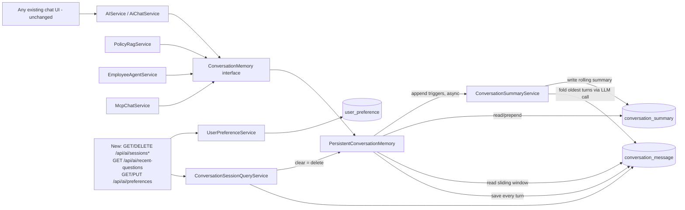

# Chat Memory Guide

## 1. Overview

This document explains the Postgres-backed chat memory system - a swap-in replacement for the
in-memory conversation store every existing chat feature already depended on
(`doc/spring_ai.md`, `doc/agent.md`, `doc/rag.md`, and the MCP chat mode). It is the first
feature in this session that changes shared infrastructure rather than adding an isolated
package, so the design goal above all else was: **every existing chat mode keeps working,
completely unaware anything changed underneath it.**

| Capability requested | Where it lives |
|---|---|
| Store: Conversation | `conversation_message` table - every USER/ASSISTANT turn, permanently |
| Store: User preferences | `user_preference` table - `GET/PUT /api/ai/preferences` |
| Store: Recent questions | Derived query over `conversation_message` - `GET /api/ai/recent-questions` |
| Support: Sliding window | `PersistentConversationMemory.get()` returns only the most recent N messages |
| Support: Persistent memory | Postgres, not a `ConcurrentHashMap` - survives an app restart |
| Support: Conversation summary | `ConversationSummaryService` - folds older turns into a rolling summary once a conversation grows past a threshold |
| Support: Session management | `GET/DELETE /api/ai/sessions*` - list, view, and delete conversations |

## 2. Why this could be almost entirely a bean swap

Every chat-capable service in this app - `AIService`/`AiChatService` (Spring AI), `PolicyRagService`
(RAG), `EmployeeAgentService` (Agent), and `McpChatService` (MCP chat) - already depended on one
shared interface:

```java
public interface ConversationMemory {
    List<ChatMessage> get(String conversationId);
    void append(String conversationId, ChatMessage message);
    void clear(String conversationId);
}
```

The only existing implementation, `InMemoryConversationMemory`, held everything in a
`ConcurrentHashMap<String, ArrayDeque<ChatMessage>>` - gone on restart, and already doing a
primitive sliding window (trimming to `app.ai.max-history-messages` on every append).

Replacing it with `PersistentConversationMemory` - same interface, same method signatures,
Postgres underneath - means **zero changes to any of the four calling services.** They still call
`memory.get(conversationId)` and `memory.append(conversationId, message)` exactly as before and
get back the same `List<ChatMessage>` shape; they have no idea persistence, summarization, or a
sliding window even happen. `InMemoryConversationMemory.java` was deleted (confirmed via
project-wide search that nothing referenced the concrete class, only the interface) rather than
left as dead code.

LangChain4j mode is deliberately **not** touched - it has always had its own, separate,
in-memory conversation handling (`doc/langchain4j.md`), kept isolated from the Spring-AI-based
features by design since it was first built. Search mode has no conversation state at all
(each query is stateless). Both are unaffected by everything in this document.

## 3. High-level architecture



## 4. Package structure

```text
com.practices.entity
├── ConversationMessage.java   One row per turn - conversationId, role, content, createdAt
├── ConversationSummary.java   One row per conversation - rolling summary of folded-away turns
└── UserPreference.java        One row per userId - preferredProvider/Model, thinkingEnabled

com.practices.repository
├── ConversationMessageRepo.java   Indexed lookups, sliding-window paging, session aggregates
├── ConversationSummaryRepo.java
└── UserPreferenceRepo.java

com.practices.ai.memory
├── ChatMessage.java                     Unchanged - the shared DTO every chat service already used
├── ConversationMemory.java              Unchanged interface
├── PersistentConversationMemory.java    NEW implementation - replaces InMemoryConversationMemory
├── ConversationSummaryService.java      Background summarization
├── ConversationSessionQueryService.java List/view/delete conversations, recent questions
├── UserPreferenceService.java
├── dto/                                 SessionSummaryResponse, SessionMessageResponse,
│                                        RecentQuestionResponse, UserPreferenceRequest/Response
└── controller/
    ├── ConversationSessionController.java   /api/ai/sessions*, /api/ai/recent-questions
    ├── UserPreferenceController.java        /api/ai/preferences
    └── MemoryExceptionHandler.java          Scoped exception handling, mirrors every other feature's
```

## 5. The `conversation_message` table and its indexes

```java
@Entity
@Table(name = "conversation_message", indexes = {
        @Index(name = "idx_conversation_message_conv_created", columnList = "conversationId, createdAt"),
        @Index(name = "idx_conversation_message_role_created", columnList = "role, createdAt")
})
public class ConversationMessage {
    @Id @GeneratedValue(strategy = GenerationType.IDENTITY) private Long id;
    @Column(nullable = false, length = 64) private String conversationId;
    @Column(nullable = false, length = 16) private String role;
    @Column(nullable = false, columnDefinition = "text") private String content;
    @Column(nullable = false) private Instant createdAt;
}
```

This is the "store all chat conversation into db, use indexing for quick load" requirement,
concretely:

- `(conversationId, createdAt)` - the sliding-window read (`ORDER BY createdAt DESC FETCH FIRST N
  ROWS ONLY`) and the full-history read (session view) both filter on `conversationId` and sort by
  `createdAt`; this composite index serves both without a full scan.
- `(role, createdAt)` - "recent questions" filters `WHERE role = 'USER'` and sorts by
  `createdAt DESC` across *every* conversation; this index serves that directly.
- `content` is `columnDefinition = "text"`, matching the existing convention in
  `KnowledgeDocument.java` (`doc/pgvector.md`) rather than a length-bounded `varchar`, since a chat
  message has no natural length cap.

Created automatically on next startup via the existing `spring.jpa.hibernate.ddl-auto=update` -
no manual migration, matching how `KnowledgeDocument`/`PolicyDocument` were added earlier in this
session.

## 6. Sliding window + persistent memory, together

`PersistentConversationMemory.get()`:

```java
List<ConversationMessage> recentDesc = messageRepo.findByConversationIdOrderByCreatedAtDesc(
        conversationId, PageRequest.of(0, windowSize));   // windowSize = app.ai.max-history-messages

List<ChatMessage> window = recentDesc.stream()
        .sorted(Comparator.comparing(ConversationMessage::getCreatedAt))
        .map(this::toChatMessage)
        .toList();

summaryRepo.findById(conversationId).ifPresent(summary -> window.add(0, toSummaryMessage(summary)));
```

The key point: **the sliding window only bounds what gets sent to the model, not what's stored.**
Every message is written to `conversation_message` on every `append()` call and is never deleted
except by an explicit session delete (§9). A conversation with 500 turns still has all 500 rows in
Postgres - `get()` just returns the most recent `windowSize` of them (plus a summary, §7) to keep
the prompt bounded and the model's context window from overflowing.

## 7. Conversation summary - folding old turns without losing them

Once a conversation's total stored message count passes `app.ai.summary-trigger-messages`
(default 80, i.e. 2x the window), `append()` kicks off summarization:

```java
long total = messageRepo.countByConversationId(conversationId);
if (total > summaryTriggerMessages) {
    summaryService.updateSummaryAsync(conversationId, total);
}
```

`ConversationSummaryService` folds only the *newly* out-of-window messages into the existing
summary (tracked via `ConversationSummary.summarizedMessageCount`), not the whole conversation
every time:

```java
int keepRecent = aiProperties.maxHistoryMessages();
long targetCovered = totalMessages - keepRecent;
int alreadyCovered = existing.map(ConversationSummary::getSummarizedMessageCount).orElse(0);
if (targetCovered <= alreadyCovered) return;   // nothing new to fold yet

List<ConversationMessage> newBatch = all.subList(alreadyCovered, cappedTarget);
// ... render conversation-summary.st with {previousSummary} + {newMessages}, call the model,
// save the result with summarizedMessageCount = cappedTarget
```

The resulting summary is prepended to `get()`'s result as a synthetic `ChatMessage` (§6) - from
every calling service's point of view, it just looks like one more line in the history they
already format with `role: content`. No calling service had to change to support this.

### 7.1 Why summarization runs on a background thread, not the request thread

The local Ollama model already takes anywhere from 30 seconds to several minutes per call (see
`doc/agent.md` §10) - and during development of this feature, one otherwise-simple two-message
exchange took over 15 minutes end-to-end under load, confirmed genuinely still computing (not
stuck) by checking Ollama's own process CPU time climbing throughout. Adding a *second* model call
synchronously inside `append()` - which runs right after every chat reply, before the HTTP
response returns - would make an already-slow response noticeably slower on every conversation
that crosses the summarization threshold.

`ConversationSummaryService` therefore submits summarization to a single dedicated daemon
background thread and returns immediately:

```java
private final ExecutorService executor = Executors.newSingleThreadExecutor(runnable -> {
    Thread thread = new Thread(runnable, "conversation-summarizer");
    thread.setDaemon(true);
    return thread;
});

public void updateSummaryAsync(String conversationId, long totalMessages) {
    executor.submit(() -> {
        try {
            updateSummary(conversationId, totalMessages);
        } catch (Exception exception) {
            log.warn("...falling back to raw sliding window only", exception);
        }
    });
}
```

This makes the summary **eventually consistent** - it may lag by one triggering append, and if it
fails outright, the sliding window keeps working with no summary at all. Both are accepted
tradeoffs for keeping every existing chat mode's response time unaffected, not oversights.

## 8. A real bug found and fixed: `clear()` needed an explicit transaction

`clear()` deletes from two tables:

```java
@Override
@Transactional
public void clear(String conversationId) {
    messageRepo.deleteByConversationId(conversationId);
    if (summaryRepo.existsById(conversationId)) {
        summaryRepo.deleteById(conversationId);
    }
}
```

The first version had no `@Transactional`. Calling `DELETE /api/ai/sessions/{id}` failed with:

```text
org.springframework.dao.InvalidDataAccessApiUsageException: No EntityManager with actual
transaction available for current thread - cannot reliably process 'remove' call
```

A derived delete-by-query method like `deleteByConversationId` needs an active transaction to
run; a single repository call gets one implicitly through `SimpleJpaRepository`, but this method
makes **two** repository calls that both need to succeed or fail together, so the transaction
boundary has to be declared explicitly at the service layer. Fixed by adding `@Transactional` to
`clear()` - verified by re-running `DELETE /api/ai/sessions/{id}` (204, and the session, its
messages, and its summary were all confirmed gone) after the fix, where it previously 503'd.

## 9. Session management

Deliberately **not** a separate table. The `conversationId` every chat mode already generates and
sends is already the natural session identifier - a session's messages, first-message title, and
timestamps are all derivable directly from `conversation_message` with a single grouped query:

```java
@Query("select m.conversationId as conversationId, min(m.createdAt) as startedAt, "
        + "max(m.createdAt) as lastActivityAt, count(m) as messageCount "
        + "from ConversationMessage m group by m.conversationId order by max(m.createdAt) desc")
List<SessionAggregate> findSessionAggregates();
```

| Endpoint | Method | Purpose |
|---|---|---|
| `/api/ai/sessions?limit=50` | `GET` | List every conversation - title (first user message, truncated), message count, started/last-activity timestamps |
| `/api/ai/sessions/{conversationId}/messages` | `GET` | Full, unwindowed transcript for one conversation |
| `/api/ai/sessions/{conversationId}` | `DELETE` | Delete a conversation's messages and summary (calls `ConversationMemory.clear()` - the exact method every chat service already had available but never called, since nothing previously exposed "delete a conversation" at all) |
| `/api/ai/recent-questions?limit=10` | `GET` | Most recent USER-role messages across every conversation |

Fetching each session's title costs one extra indexed query per row in the returned page
(`findFirstByConversationIdAndRoleOrderByCreatedAtAsc`) - acceptable at this app's scale (a
handful to a few dozen conversations), called out here rather than silently accepted as a known
place to optimize (batch-fetch titles) if this ever needs to scale to many more sessions.

## 10. User preferences

A fixed-column table, not a generic key/value store - matches this codebase's plain-entity style
(`Employee`, `KnowledgeDocument`) rather than introducing a more generic pattern for three known
fields:

```java
@Entity
@Table(name = "user_preference")
public class UserPreference {
    @Id @Column(length = 64) private String userId;
    private String preferredProvider;
    private String preferredModel;
    private Boolean thinkingEnabled;
    @Column(nullable = false) private Instant updatedAt;
}
```

`GET /api/ai/preferences?userId=...` / `PUT /api/ai/preferences` (body: `userId`,
`preferredProvider`, `preferredModel`, `thinkingEnabled`). Deliberately **not** wired into any
existing chat request/response - `ChatRequest`/`ChatResponse` and every existing controller are
completely unchanged. This is a standalone pair of endpoints a frontend can call independently
(load once on init, save on change) without touching the chat flow at all.

**Scope note:** this app has no authentication, so `userId` is just an opaque client-supplied
string - there is no verification that whoever sends a given `userId` is entitled to it. A real
deployment would derive `userId` from an authenticated session rather than trusting a client-sent
value, the same caveat already noted for every other unauthenticated write endpoint in this app
(`doc/spring_ai.md` §24, `doc/agent.md` §13). No frontend changes were made for this feature - the
backend endpoints are ready for a UI to call whenever wanted.

## 11. Verified behavior

Tested against the real running application and real Postgres, including across a full process
restart:

| Test | Result |
|---|---|
| Existing Spring AI chat (`POST /api/ai/chat`) on a brand-new `conversationId` | Unchanged behavior end-to-end - `AiChatService`/`AIService` required no code changes; the model still received an empty history for a fresh conversation exactly as before |
| `GET /api/ai/sessions` after that chat | Returned the conversation with a correct title (the user's question), `messageCount: 2`, correct timestamps |
| `GET /api/ai/sessions/{id}/messages` | Returned both the USER and ASSISTANT rows verbatim, confirming real persistence, not just an in-request echo |
| `GET /api/ai/recent-questions` | Returned the user's question |
| `PUT` then `GET /api/ai/preferences?userId=test-user-1` | Round-tripped correctly |
| **Full app process kill + restart**, then `GET /api/ai/preferences?userId=test-user-1` again | Preferences still there - real Postgres persistence, not `InMemoryConversationMemory`'s old in-JVM state |
| `DELETE /api/ai/sessions/{id}` (after the `@Transactional` fix, §8) | `204 No Content`; the session, its messages, and its recent-questions entry were all confirmed gone afterward |
| Existing `/employee/getall`, `/api/ai/models`, `/api/ai/semantic-search`, `/api/ai/policy-documents`, `/api/ai/documents`, and the raw MCP `/mcp` `initialize` handshake | All rechecked and unaffected |
| App startup with the new `PersistentConversationMemory` bean | Succeeded cleanly - proves `AIService`/`AiChatService`, `PolicyRagService`, `EmployeeAgentService`, and `McpChatService` all still resolve their `ConversationMemory` dependency correctly with no ambiguous- or missing-bean errors |

**Not individually re-run this pass:** full multi-minute LLM round trips specifically through
Policy/Agent/MCP chat mode (as opposed to Spring AI mode, which *was* run end-to-end above) - the
local model was running unusually slowly during this feature's development (over 15 minutes for a
single exchange at one point). Since all three depend on the exact same unchanged
`ConversationMemory` interface and the same bean successfully resolved for all of them at startup,
this is considered low-risk, but worth calling out explicitly rather than silently claiming full
coverage.

## 12. Configuration

```properties
# Chat memory (Postgres-backed, see doc/memory.md): how many of the most recent messages are sent
# to the model as raw history, and the total-stored-message count past which older turns get
# folded into a rolling summary instead of being dropped.
app.ai.max-history-messages=40
app.ai.summary-trigger-messages=80
```

Both already had defaults baked into `AiProperties`'s compact constructor
(`summaryTriggerMessages` defaults to `2 * maxHistoryMessages` if unset or non-positive) - listed
explicitly in `application.properties` for visibility, matching this project's existing style of
spelling out AI-related tunables even when a default would apply.

## 13. Known limitations and possible follow-ups

- **No per-user isolation on `userId`** (§10) - anyone can read or overwrite any `userId`'s
  preferences by simply naming it. Not a concern for this single-user demo app; would need real
  authentication before any multi-user deployment.
- **Session title fetch is one extra query per listed session** (§9) - fine at this app's current
  scale; would need batching (or a denormalized `firstMessage` column) to stay fast with many more
  conversations.
- **Summarization is best-effort and eventually consistent** (§7.1) - a summary can lag behind the
  actual conversation by one append, and a failed summarization attempt silently leaves the
  sliding window as the only context (logged as a warning, never surfaced as an error to the
  user).
- **No UI was built for any of this** - `GET/DELETE /api/ai/sessions*`, `GET
  /api/ai/recent-questions`, and `GET/PUT /api/ai/preferences` are ready to be wired into the
  Angular AI panel (a session list/resume view, a preferences-restore-on-load flow) whenever
  that's wanted; this pass was scoped to the storage layer and API only, per the request.

## 14. File reference

| File | Responsibility |
|---|---|
| `entity/ConversationMessage.java` | Every persisted chat turn, indexed for fast per-conversation and cross-conversation reads |
| `entity/ConversationSummary.java` | Rolling summary of folded-away older turns, one row per conversation |
| `entity/UserPreference.java` | Per-userId preferred provider/model/thinking-mode |
| `repository/ConversationMessageRepo.java` | Indexed queries + the grouped session-aggregate query |
| `repository/ConversationSummaryRepo.java`, `UserPreferenceRepo.java` | Plain `JpaRepository`s |
| `ai/memory/PersistentConversationMemory.java` | Replaces `InMemoryConversationMemory` (deleted) - identical interface, Postgres-backed, sliding window + summary prepend |
| `ai/memory/ConversationSummaryService.java` | Background, incremental summarization |
| `ai/memory/ConversationSessionQueryService.java` | List/view/delete sessions, recent questions |
| `ai/memory/UserPreferenceService.java` | Get/save preferences |
| `ai/memory/dto/*` | Request/response records for the new endpoints |
| `ai/memory/controller/ConversationSessionController.java` | `/api/ai/sessions*`, `/api/ai/recent-questions` |
| `ai/memory/controller/UserPreferenceController.java` | `/api/ai/preferences` |
| `ai/memory/controller/MemoryExceptionHandler.java` | Scoped exception handling, mirrors every other feature's |
| `ai/config/AiProperties.java` | Added `summaryTriggerMessages` (additive field) |
| `prompts/conversation-summary.st` | Summarization prompt template |
| `application.properties` | `app.ai.max-history-messages`, `app.ai.summary-trigger-messages` |

**Unchanged** (the entire point of this design): `ai/memory/ChatMessage.java`,
`ai/memory/ConversationMemory.java`, `ai/service/AIService.java`, `ai/service/AiChatService.java`,
`ai/rag/PolicyRagService.java`, `ai/agent/EmployeeAgentService.java`,
`ai/mcp/client/McpChatService.java`, every existing controller and DTO, and the entire Angular
frontend.

## 15. Architectural rules

1. `ConversationMemory`'s interface (`get`/`append`/`clear`) must not change - every chat-capable
   service depends on it, and the entire value of this design is that they never need to know
   whether it's backed by memory or Postgres.
2. `PersistentConversationMemory.get()` must never grow unbounded - it always returns at most the
   configured window plus one synthetic summary message, regardless of how large the underlying
   conversation has grown.
3. Raw conversation rows are never deleted by the sliding window or by summarization - only an
   explicit `clear()` (session delete) removes them. Summarization only ever *reads* older rows
   and writes a summary; it must never delete what it summarized.
4. Any multi-repository write (like `clear()`) must be wrapped in `@Transactional` at the service
   layer - a single Spring Data repository call gets an implicit transaction, two or more calls
   that must succeed or fail together do not, automatically.
5. Summarization must run off the request thread and must never let a failure propagate to the
   caller - a chat reply must return at its normal speed and succeed even if summarization is slow
   or broken.
6. User preferences must stay fully decoupled from the chat request/response contracts - no
   existing `ChatRequest`/`ChatResponse` field, controller, or DTO may be modified to support
   preferences.
