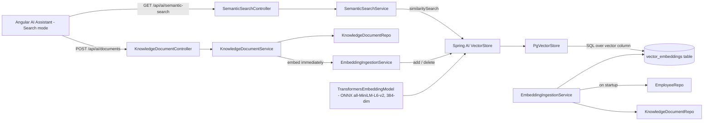

# pgvector Semantic Search Guide

## 1. Overview

This document explains the pgvector-backed semantic search feature - the fifth AI capability
in this application, alongside Spring AI chat (`doc/spring_ai.md`), Spring AI function calling
(`doc/function_calling.md`), LangChain4j (`doc/langchain4j.md`), and the Employee AI Agent
(`doc/agent.md`).

It lets a natural-language query like *"Java developer"*, *"Backend engineer"*, or *"Kafka
expert"* find related employees - and, distinctly from every other feature in this app, also
find free-text **documents** (skills notes, resume excerpts, anything) linked to an employee -
ranked by embedding similarity rather than exact keyword match.

| Endpoint | Method | Purpose |
|---|---|---|
| `/api/ai/semantic-search` | `GET` | The requested endpoint - search employees + documents by meaning |
| `/api/ai/semantic-search/reindex` | `POST` | Rebuild the vector index from current Postgres data |
| `/api/ai/documents` | `POST` | Create a document and index it immediately |
| `/api/ai/documents` | `GET` | List all documents |

No existing endpoint, entity, or Angular component was changed to build this - it is entirely
additive, in a new `com.practices.ai.embedding` package and a new `KnowledgeDocument` entity.

## 2. Why pgvector, and why it needed a real installation step

"Implement pgvector" specifically meant storing embeddings in Postgres using the `vector`
extension, not an in-memory or third-party vector database. This turned out to require an
actual infrastructure change, not just code:

**The local Postgres 16 installation had no `vector` extension available at all**
(`SELECT * FROM pg_available_extensions WHERE name = 'vector'` returned zero rows). This is a
native, compiled Postgres extension - it cannot be enabled by SQL or Spring configuration
alone. The official pgvector project does not publish Windows binaries, so the only practical
option was a third-party prebuilt binary
([andreiramani/pgvector_pgsql_windows](https://github.com/andreiramani/pgvector_pgsql_windows)).

Installing it required Windows administrator rights (stopping the `postgresql-x64-16` service,
writing into `C:\Program Files\PostgreSQL\16\`) that the automated environment building this
feature did not have. The user ran the installation themselves, in an elevated PowerShell:

```powershell
Stop-Service postgresql-x64-16 -Force
Invoke-WebRequest -Uri "https://github.com/andreiramani/pgvector_pgsql_windows/releases/download/0.8.3_16.14/vector.v0.8.3-pg16.zip" -OutFile "$env:TEMP\vector.zip"
Expand-Archive -Path "$env:TEMP\vector.zip" -DestinationPath "C:\Program Files\PostgreSQL\16" -Force
Start-Service postgresql-x64-16
```

```sql
CREATE EXTENSION vector;
```

Verified installed version: `0.8.3`. **This is a one-time, per-machine setup step** - anyone
running this project against a fresh Postgres instance needs to do the same (or use a Postgres
distribution/Docker image with pgvector already built in) before this feature will work.

## 3. High-level architecture



## 4. Package structure

```text
com.practices.ai.embedding
├── EmbeddingIngestionService.java       Keeps the vector store in sync with Postgres
├── SemanticSearchService.java           Runs similarity search, maps results
├── KnowledgeDocumentService.java        Create/list documents, triggers immediate indexing
├── dto/
│   ├── SemanticSearchResult.java        One ranked match (employee or document)
│   ├── SemanticSearchResponse.java      GET /semantic-search response
│   ├── ReindexResponse.java             POST /semantic-search/reindex response
│   ├── DocumentRequest.java             POST /documents request
│   └── DocumentResponse.java            Document response shape
└── controller/
    ├── SemanticSearchController.java        /api/ai/semantic-search, /reindex
    ├── KnowledgeDocumentController.java     /api/ai/documents
    └── EmbeddingExceptionHandler.java       Scoped exception handling for both controllers
```

New entity and repository (outside the `ai` package, alongside `Employee`):

```text
com.practices.entity.KnowledgeDocument
com.practices.repository.KnowledgeDocumentRepo
```

## 5. Maven and configuration

Two Spring AI starters, both already covered by the existing `spring-ai-bom` import - no new
BOM or version property needed:

```xml
<dependency>
    <groupId>org.springframework.ai</groupId>
    <artifactId>spring-ai-starter-model-transformers</artifactId>
</dependency>
<dependency>
    <groupId>org.springframework.ai</groupId>
    <artifactId>spring-ai-starter-vector-store-pgvector</artifactId>
</dependency>
```

`application.properties`:

```properties
# Embeddings / semantic search (pgvector)
# transformers = self-contained, in-process ONNX embedding model (all-MiniLM-L6-v2, 384 dims).
# Explicit selection avoids colliding with the Ollama embedding autoconfiguration, which is
# also on the classpath via spring-ai-starter-model-ollama.
spring.ai.model.embedding=transformers
spring.ai.vectorstore.pgvector.initialize-schema=true
spring.ai.vectorstore.pgvector.dimensions=384
spring.ai.vectorstore.pgvector.table-name=vector_embeddings
```

### 5.1 Why `spring.ai.model.embedding=transformers` is required, not optional

`spring-ai-starter-model-ollama` (already a dependency for chat) also auto-configures an
`OllamaEmbeddingModel` bean by default. Adding the transformers starter on top means **two**
`EmbeddingModel` candidates exist unless one is explicitly selected - inspecting both
autoconfiguration classes confirmed each is gated by
`@ConditionalOnProperty(name = "spring.ai.model.embedding", havingValue = "<ollama|transformers>")`,
mirroring the exact pattern this project already uses for `spring.ai.model.chat` in
`AIConfig`/`doc/spring_ai.md`. Setting the property to `transformers` disables the Ollama
embedding autoconfiguration and activates this one - one property line, no bean exclusion or
qualifier code needed, and `spring.ai.model.chat=ollama` (chat) is completely unaffected.

### 5.2 Why the ONNX model is self-contained, not an Ollama model

`TransformersEmbeddingModel` downloads its default model
(`all-MiniLM-L6-v2`, 384 dimensions) from Spring AI's own GitHub-hosted release assets on
first startup and caches it - both URLs were checked reachable (200 OK, ~90MB model +
~700KB tokenizer) before committing to this approach. This avoids requiring the user to
`ollama pull` a separate embedding model, at the cost of a one-time download and roughly a
minute of extra startup time. The download is **not currently cached across `mvnw
spring-boot:run` invocations** (each run gets a fresh temp cache directory) - see §11 for a
possible follow-up.

## 6. The `vector_embeddings` table

Created automatically by `PgVectorStore` (`initialize-schema=true`) - this is the "create
embeddings table" requirement. Conceptually:

| Column | Type | Purpose |
|---|---|---|
| `id` | `uuid` | Primary key - must be a valid UUID (see §7.1) |
| `content` | `text` | The embedded text |
| `metadata` | `jsonb` | Arbitrary key/value data - `type`, `referenceId`, `name`/`title`, `employeeId` |
| `embedding` | `vector(384)` | The actual embedding, dimension matched to the transformers model |

Verified directly: `SELECT count(*) FROM vector_embeddings;` reflects exactly the number of
indexed employees plus documents at any point.

## 7. `EmbeddingIngestionService` - keeping the index in sync

File: `src/main/java/com/practices/ai/embedding/EmbeddingIngestionService.java`

### 7.1 Deterministic, UUID-shaped ids

Every embedded `Document` needs a stable id so re-indexing the same row **overwrites** its
vector instead of accumulating duplicates. The natural choice - a logical key like
`"employee-6"` - does not work:

```text
java.lang.IllegalArgumentException: Invalid UUID string: employee-6
	at org.springframework.ai.vectorstore.pgvector.PgVectorStore.convertIdToPgType
```

`PgVectorStore`'s default id column is typed `uuid`, and it parses the `Document`'s id
string as one. The fix - derive a deterministic UUID from the logical key instead of using it
directly:

```java
private String deterministicId(String type, Long id) {
    return UUID.nameUUIDFromBytes((type + "-" + id).getBytes(StandardCharsets.UTF_8)).toString();
}
```

Same input always produces the same UUID, so `vectorStore.add(...)` for an already-indexed
employee overwrites the existing row (`PgVectorStore` upserts on primary key) rather than
creating a duplicate.

### 7.2 Full reindex is delete-then-rebuild, not incremental

```java
public int reindexEmployees() {
    vectorStore.delete(new FilterExpressionBuilder().eq("type", TYPE_EMPLOYEE).build());
    List<Document> documents = employeeRepo.findAll().stream().map(this::toDocument).toList();
    if (!documents.isEmpty()) {
        vectorStore.add(documents);
    }
    ...
}
```

Deleting every row tagged `type=employee` before re-adding the current set means an employee
**deleted** from Postgres also disappears from the vector index - not just updated/new
employees. The same pattern applies to documents, independently (each type is deleted and
rebuilt separately, so reindexing employees never touches document vectors and vice versa).

### 7.3 Why this isn't wired into the live CRUD write path

`createEmployee`/`updateEmployee`/`deleteEmployee` (`EmpController`, `EmployeeCrudTools`, the
Agent's execute step) do **not** trigger re-indexing. Two reasons:

1. **Do not break existing logic.** Those write paths are fast, synchronous Postgres calls
   today. Adding an embedding computation + vector upsert inline would add real latency
   (ONNX inference, even if fast, is not free) to code paths that were explicitly required to
   stay unaffected.
2. **Consistency with an existing, already-documented tradeoff.** LangChain4j's retrieval
   (`doc/langchain4j.md` §10, §15) has the identical limitation for the same reason, and is
   already accepted as a known, documented gap rather than solved by coupling ingestion into
   CRUD.

Instead: employees and documents are indexed at startup (`@EventListener(ApplicationReadyEvent.class)`),
documents are indexed immediately on creation (§9, since that endpoint is new and has no
existing-behavior constraint), and `POST /api/ai/semantic-search/reindex` is available to
manually refresh employee data after CRUD changes. **The index can go stale for employees
between a CRUD write and the next reindex** - this is a real, accepted limitation, not an
oversight.

### 7.4 A start-up-crashing bug found and fixed

The first attempt did not set `spring.ai.vectorstore.pgvector.initialize-schema=true`. The app
still logged `Initializing PGVectorStore schema for table: vector_embeddings` (misleadingly
suggesting it worked) but never actually ran the `CREATE TABLE` - so the startup reindex's
first `DELETE FROM vector_embeddings` failed with `relation "vector_embeddings" does not
exist`.

That exception propagated out of an `@EventListener(ApplicationReadyEvent.class)` method - and
an `ApplicationReadyEvent` listener that throws **aborts the entire Spring Boot startup**
(`Application run failed`), even though Tomcat had already started and logged "Started
EmpCrudApplication" moments earlier. The whole application - core CRUD, chat, agent,
everything - would have gone down over a semantic-search-only misconfiguration. Fixed two
ways:

1. `initialize-schema=true` added, so the table genuinely gets created.
2. `ingestOnStartup()` wrapped in try/catch regardless, on the principle that indexing
   problems must never be allowed to take the whole application down:

```java
@EventListener(ApplicationReadyEvent.class)
public void ingestOnStartup() {
    try {
        ReindexResponse result = reindexAll();
        log.info("[EMBEDDING] startup reindex complete: employees={} documents={}", ...);
    } catch (Exception exception) {
        log.warn("[EMBEDDING] startup reindex failed - semantic search may return stale or no "
                + "results until POST /api/ai/semantic-search/reindex is called", exception);
    }
}
```

## 8. `SemanticSearchService` - ranking and mapping results

File: `src/main/java/com/practices/ai/embedding/SemanticSearchService.java`

```java
List<Document> matches = vectorStore.similaritySearch(SearchRequest.builder()
        .query(normalized)
        .topK(topK != null && topK > 0 ? topK : DEFAULT_TOP_K)
        .build());
```

`VectorStore.similaritySearch(SearchRequest)` embeds the query text with the same
`TransformersEmbeddingModel` and runs a cosine-similarity ranking against
`vector_embeddings` - this single call is the actual "implement similarity search"
requirement; no manual SQL or distance calculation was written.

Each result's `metadata` (stored as `jsonb` alongside its vector) is used to reconstruct a
human-readable result without a second database query:

```java
String title = switch (String.valueOf(type)) {
    case "employee" -> String.valueOf(document.getMetadata().get("name"));
    case "document" -> String.valueOf(document.getMetadata().get("title"));
    default -> "Unknown";
};
```

Validation mirrors the existing `/api/ai/search` endpoint's style
(`EmployeeSearchTool`/`AiSearchService`) - blank query rejected, query capped at 200
characters - for consistency with the app's established input-validation convention.

## 9. Documents - the second embedding source

Requested explicitly ("Generate embeddings for Employees, Documents"), and functionally
necessary: general-purpose sentence embeddings only catch what's actually written down. An
employee's structured fields (name, department, `role`, performance, experience) support
queries like *"Java developer"* well, but a query like *"Kafka expert"* has nothing to match
unless *something* mentions Kafka. `KnowledgeDocument` is free text - a skills note, resume
excerpt, or any other blurb - optionally linked to an employee via `employeeId`, that becomes
independently searchable and can carry exactly that kind of detail.

```java
public KnowledgeDocument create(String title, String content, Long employeeId) {
    ...
    KnowledgeDocument saved = documentRepo.save(document);
    ingestionService.indexDocument(saved);   // embedded immediately - new endpoint, no legacy latency constraint
    return saved;
}
```

Unlike employee writes (§7.3), document creation embeds synchronously on save - this is a
brand new endpoint with no pre-existing performance expectation to protect, so there was no
reason to defer indexing to a manual reindex call here.

## 10. Verified behavior

Measured against the real database and the real ONNX model, not mocked - including the
specific three example queries from the requirements:

| Test | Result |
|---|---|
| pgvector extension check | `SELECT * FROM pg_extension WHERE extname='vector'` -> version `0.8.3`, confirmed active |
| Startup reindex | `[EMBEDDING] reindexed 7 employees` / `reindexed 0 documents` (before any documents existed) - table row count matched exactly |
| **"Java developer"** | Top 2 results were the two employees with `role = "Java Developer"` (scores 60%, 54%), clearly separated from unrelated employees (25-37%) |
| **"Backend engineer"** | Sensibly ranked DevOps/Java-role employees above unrelated departments, with no exact keyword match required |
| **"Kafka expert"** (before adding a document) | All scores low and close together (15-21%) - no employee text mentions Kafka, so the model had nothing strong to match |
| Added a `KnowledgeDocument` describing "Dipak Borade... Kafka migrations... Kafka expert", linked via `employeeId` | Re-ran **"Kafka expert"** - the document jumped to the top result at 58%, more than double the next-best match (21%) |
| `POST /api/ai/semantic-search/reindex` | Returned `{"employeesIndexed":7,"documentsIndexed":1}`, matching actual row counts |
| New unrelated document ("payroll and compensation specialist") + query **"payroll specialist"** | Correctly surfaced that specific document as the top result, confirming the ranking isn't coincidental to the Kafka example |
| Existing `/employee/*`, `/api/ai/health`, `/api/ai/models` | Rechecked working and unaffected throughout every restart during this feature's development |
| Angular Search mode (Playwright) | Result cards render with type badge, title, score percentage, and snippet; "+ Document" button (previously a disabled placeholder) opens a real inline form that saves and immediately confirms indexing |

## 11. Known limitations and possible follow-ups

- **Employee index staleness** (§7.3): CRUD writes to employees do not automatically
  re-index. Call `POST /api/ai/semantic-search/reindex` after bulk changes (e.g. after the
  Employee AI Agent applies a plan) if search freshness matters immediately.
- **No per-machine persistent ONNX model cache observed across `mvnw spring-boot:run`
  restarts** - each run re-downloaded the ~90MB model rather than reusing a prior run's cache,
  adding roughly a minute to every restart during development. `TransformersEmbeddingModel`
  exposes `setResourceCacheDirectory(String)` if a persistent, project-local cache path is
  wanted later.
- **No relevance floor.** `similaritySearch` always returns up to `topK` results even when the
  best match is a weak 15% - as seen in the "Kafka expert before a document existed" case. A
  future improvement could apply `SearchRequest.builder().similarityThreshold(...)` to
  suppress low-confidence matches, or surface the score prominently enough (already done in
  the UI) that a low score reads as "weak match" rather than a confident answer.
- **The third-party pgvector Windows binary** (§2) is not the official project's own build.
  Reasonable for local development; a production deployment should use a Postgres
  distribution/Docker image that bundles pgvector officially (e.g. `pgvector/pgvector` Docker
  images, or a managed Postgres offering with pgvector support) rather than this binary.

## 12. Security considerations

In addition to the general notes in the other AI docs:

- `POST /api/ai/documents` has no authentication or authorization - anyone who can reach the
  API can add arbitrary text that becomes searchable and is returned verbatim in search
  results. Treat it the same as any other unauthenticated write endpoint in this app today
  (none are currently secured - see `doc/spring_ai.md` §24) and add access control before
  production use.
- Document `content` is stored and returned as-is (no HTML/script sanitization) - the Angular
  template renders it via text interpolation (not `innerHTML`), so this is not an XSS vector
  in the current frontend, but any future consumer that renders it as HTML would need to
  sanitize first.
- Employee data embedded into `vector_embeddings.content` (name, department, role,
  performance, experience) is stored in plain text inside the vector table, separate from the
  `employee` table's own access controls (there are none today, but if added later, remember
  the vector table is a second copy of this data that would also need protecting).

## 13. File reference

| File | Responsibility |
|---|---|
| `pom.xml` | `spring-ai-starter-model-transformers`, `spring-ai-starter-vector-store-pgvector` |
| `application.properties` | Embedding provider selection, pgvector schema/table/dimension config |
| `entity/KnowledgeDocument.java` | The "Documents" embedding source entity |
| `repository/KnowledgeDocumentRepo.java` | Plain `JpaRepository` for documents |
| `ai/embedding/EmbeddingIngestionService.java` | Startup + manual reindexing, deterministic UUID ids, delete-then-rebuild |
| `ai/embedding/SemanticSearchService.java` | Runs `VectorStore.similaritySearch`, maps results |
| `ai/embedding/KnowledgeDocumentService.java` | Create/list documents, triggers immediate indexing |
| `ai/embedding/dto/*` | Request/response records for search, reindex, and documents |
| `ai/embedding/controller/SemanticSearchController.java` | `/api/ai/semantic-search`, `/reindex` |
| `ai/embedding/controller/KnowledgeDocumentController.java` | `/api/ai/documents` |
| `ai/embedding/controller/EmbeddingExceptionHandler.java` | Scoped exception handling, mirrors `AiExceptionHandler` |
| Angular `ai/components/ai-panel/` | "Search" provider mode, result-card rendering, document-add form (repurposed the previously-disabled "+ Document" button) |

No other file was modified to implement this feature.

## 14. Architectural rules

1. Every embedded `Document`'s id must be a deterministic function of its logical key (type +
   database id), never random - this is what makes reindexing idempotent rather than
   duplicate-accumulating.
2. A full reindex for a given type must delete that type's existing vectors before re-adding,
   so deleted Postgres rows don't linger as orphaned, stale search results.
3. `EmbeddingIngestionService.ingestOnStartup()` must never let an exception propagate - an
   indexing failure must degrade semantic search, not crash the whole application.
4. CRUD write paths for `Employee` do not call into embedding/indexing code directly (§7.3) -
   freshness is handled via startup indexing and the manual reindex endpoint, not by coupling
   unrelated features together.
5. `KnowledgeDocument` content is arbitrary free text by design - do not add structured
   fields to it that duplicate what belongs on `Employee`; use `employeeId` to link, not
   denormalized copies of employee data.
6. This feature must not change any existing endpoint's request/response shape - it is
   additive only, under `/api/ai/semantic-search` and `/api/ai/documents`.
