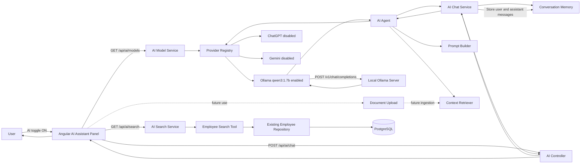

# Project Foundation: AI Module

## 1. Purpose

This document describes the AI Assistant module added to the Employee CRUD application.
It is the implementation reference for the Angular UI, Spring Boot API, Ollama integration,
conversation memory, employee search tool, provider abstraction, RAG extension point, and
future cloud-model support.

The module was designed as an isolated vertical feature. Existing employee CRUD endpoints
and the existing `EmpController` were not changed by the AI implementation. When the AI
toggle is off, the Employee CRUD UI behaves as before.

## 2. Current implementation status

Implemented:

- Angular AI toggle mounted at application level.
- Responsive right-side AI Assistant panel.
- Chat messages, prompt textbox, send action, loading state, errors, and keyboard submission.
- Browser-persisted visible chat history using `localStorage`.
- Clear-chat action that starts a new frontend conversation.
- Model selector populated by the backend.
- Ollama model `qwen3:1.7b` enabled and selected by default.
- ChatGPT and Gemini displayed as disabled, not-configured options.
- Document upload button displayed as a disabled future-use control.
- Spring Boot endpoints for chat, models, and employee search.
- OpenAI-compatible HTTP provider used by local Ollama.
- Built-in local fallback provider.
- Bounded in-memory backend conversation history.
- Prompt construction and RAG interfaces.
- Employee search tool backed by the existing employee repository.
- AI-specific exception handling.

Prepared as extension points, but not fully implemented:

- Document ingestion and upload endpoint.
- Vector database and document retrieval.
- Persistent or distributed conversation memory.
- Real Gemini provider.
- Real ChatGPT configuration in the current model catalog.
- Authentication, authorization, rate limiting, metrics, and audit storage.

## 3. Project locations

Backend:

```text
G:\practise\back_end\java\source_code\employee_crud_app
```

Frontend:

```text
G:\practise\front_end\angular\employee-ui
```

Backend AI root package:

```text
src/main/java/com/practices/ai
```

Frontend AI feature:

```text
src/app/ai
```

## 4. High-level architecture and flow



### Chat request sequence

1. Angular loads `/api/ai/models` when the assistant component initializes.
2. The first model marked `available=true` becomes the selected model.
3. The user submits a prompt.
4. Angular immediately adds the user message to the visible chat history.
5. Angular sends the prompt, selected model, and optional conversation ID to `/api/ai/chat`.
6. `AiChatService` validates the message and creates a UUID for a new conversation.
7. Existing backend history is loaded from `ConversationMemory`.
8. `AiAgent` asks the RAG retriever for optional context.
9. `PromptBuilder` combines the system prompt with retrieved context.
10. `AiProviderRegistry` chooses the provider that supports the requested model.
11. `OpenAiCompatibleProvider` sends the request to Ollama's OpenAI-compatible endpoint.
12. The assistant response is returned and both messages are stored in backend memory.
13. Angular displays the response and persists the visible messages in `localStorage`.

## 5. Backend package design

```text
com.practices.ai
├── agent
├── config
├── controller
│   └── dto
├── memory
├── prompt
├── provider
├── rag
├── service
└── tools
```

Dependencies point inward through interfaces where replacement is expected. Controllers
delegate to services; services coordinate agents, memory, and tools; the agent selects a
provider through the registry. Existing employee CRUD controller methods are not called or
modified by this flow.

## 6. Backend file reference

### `ai/config/AiProperties.java`

Maps `app.ai.*` Spring configuration into immutable Java records.

Important settings:

- `defaultModel`: model used when a request does not provide one.
- `maxHistoryMessages`: maximum backend messages retained per conversation; defaults to 40.
- `provider.baseUrl`: OpenAI-compatible API root.
- `provider.apiKey`: provider credential or non-empty Ollama placeholder.
- `provider.models`: supported model IDs.
- `provider.timeout`: connection/request timeout; defaults to 45 seconds.
- `provider.systemPrompt`: base assistant instruction.

`Provider.isConfigured()` requires a non-empty API key and at least one model. Ollama does
not authenticate the key, but the current provider abstraction uses `ollama` as a harmless
non-empty placeholder.

### `ai/config/AiConfiguration.java`

Enables `AiProperties` and creates the shared Java `HttpClient`. The configured provider
timeout is used as its connection timeout.

### `ai/controller/AiController.java`

Exposes the isolated `/api/ai` REST API and delegates all work to services. `@CrossOrigin`
allows the Angular development server to call the backend.

Endpoints:

- `POST /api/ai/chat`
- `GET /api/ai/models`
- `GET /api/ai/search?query=...`

### `ai/controller/AiExceptionHandler.java`

Handles exceptions raised by `AiController` only.

- `IllegalArgumentException` becomes HTTP `400 Bad Request`.
- Unexpected provider or service errors become HTTP `503 Service Unavailable`.
- Error responses include timestamp, status, and a safe user-facing message.

### `ai/controller/dto/ChatRequest.java`

Chat request contract:

```json
{
  "conversationId": "optional-conversation-uuid",
  "message": "Explain this employee workspace",
  "model": "qwen3:1.7b"
}
```

### `ai/controller/dto/ChatResponse.java`

Chat response contract:

```json
{
  "conversationId": "generated-or-existing-uuid",
  "message": "Assistant response",
  "model": "qwen3:1.7b",
  "createdAt": "2026-07-04T13:30:00Z"
}
```

### `ai/controller/dto/ModelResponse.java`

Represents a model-selector item:

```json
{
  "id": "qwen3:1.7b",
  "displayName": "Ollama: qwen3:1.7b",
  "provider": "Ollama",
  "available": true
}
```

Angular disables dropdown options whose `available` value is `false`.

### `ai/controller/dto/SearchResponse.java`

Contains the normalized search query and a list of search results. Every result has a
`type`, `title`, and `summary`.

### `ai/service/AiChatService.java`

Owns the chat use case.

- Rejects blank messages.
- Limits input to 8,000 characters.
- Generates a conversation UUID when none is supplied.
- Uses the configured default model when needed.
- Loads history before invoking the agent.
- Stores the user and assistant messages after a successful provider response.

Provider failures do not add an assistant response to memory.

### `ai/service/AiModelService.java`

Builds the model catalog returned to Angular.

Current behavior:

- When Ollama is available, the built-in local fallback is hidden.
- `Ollama: qwen3:1.7b` is enabled.
- `ChatGPT (not configured)` is visible and disabled.
- `Gemini (not configured)` is visible and disabled.

This service is the correct place to evolve model-display policy independently from actual
provider invocation.

### `ai/service/AiSearchService.java`

Validates employee-search queries and invokes `EmployeeSearchTool`.

- Blank queries are rejected.
- Query length is limited to 200 characters.

### `ai/agent/AiAgent.java`

Coordinates one AI response without knowing HTTP or UI details.

1. Resolves the requested provider.
2. Retrieves RAG context.
3. Builds the system prompt.
4. Sends prompt, history, and message to the provider.

### `ai/provider/AiProvider.java`

Provider abstraction. A provider must:

- Report whether it supports a model.
- Complete a chat request.
- Publish its model metadata.

Implement this interface to add a native Gemini provider, another Ollama instance, Azure
OpenAI, or another hosted model.

### `ai/provider/AiProviderRegistry.java`

Receives all Spring `AiProvider` beans and selects the first provider supporting the model.
Unknown or unavailable models produce a validation error rather than silently falling back.

### `ai/provider/OpenAiCompatibleProvider.java`

Connects to OpenAI-compatible chat-completions APIs using Java `HttpClient` and Jackson 3.

Request target:

```text
{app.ai.provider.base-url}/chat/completions
```

For the local configuration this becomes:

```text
http://localhost:11434/v1/chat/completions
```

The request contains:

- System message.
- Previous user/assistant history.
- Current user message.
- Selected model.
- Temperature `0.2`.

If the base URL points to port `11434`, published models are labeled as Ollama models.

### `ai/provider/LocalAiProvider.java`

Provides `local-assistant`, a deterministic fallback proving that the application pipeline
is connected even when no external provider is configured. It does not generate an LLM
answer. It is hidden from the dropdown while Ollama is configured.

### `ai/memory/ChatMessage.java`

Immutable backend message containing role (`USER` or `ASSISTANT`), content, and creation
time.

### `ai/memory/ConversationMemory.java`

Memory abstraction defining `get`, `append`, and `clear`. A database, Redis, or another
persistent implementation can replace the in-memory implementation.

### `ai/memory/InMemoryConversationMemory.java`

Thread-safe, application-process memory based on `ConcurrentHashMap` and synchronized
message deques. Each conversation is bounded by `maxHistoryMessages`.

Important operational behavior:

- History disappears when Spring Boot restarts.
- Memory is not shared between multiple backend instances.
- Conversation entries currently have no time-to-live cleanup.

Use Redis or PostgreSQL before horizontally scaling chat persistence.

### `ai/prompt/PromptBuilder.java`

Returns the configured system prompt and appends retrieved application context when present.
It also copies chat history before provider use.

### `ai/rag/ContextRetriever.java`

RAG abstraction. Given a query, it returns text context that can be added to the system
prompt.

### `ai/rag/NoOpContextRetriever.java`

Current RAG implementation. It returns an empty list, so no document knowledge is injected.
Replace this component when document ingestion, chunking, embeddings, and vector search are
implemented.

### `ai/tools/EmployeeSearchTool.java`

Reads employees through the existing `EmployeeRepo` and matches the query against:

- Employee name.
- Department.
- Performance.

It returns at most 20 results. This is used by `/api/ai/search`; the chat agent does not yet
automatically invoke the tool.

### `application.properties`

Current local Ollama configuration:

```properties
app.ai.provider.api-key=ollama
app.ai.provider.models=qwen3:1.7b
app.ai.provider.base-url=http://localhost:11434/v1
app.ai.default-model=qwen3:1.7b
```

For a shared or production deployment, prefer environment placeholders instead of committed
secrets:

```properties
app.ai.provider.api-key=${APP_AI_PROVIDER_API_KEY:}
app.ai.provider.models=${APP_AI_PROVIDER_MODELS:qwen3:1.7b}
app.ai.provider.base-url=${APP_AI_PROVIDER_BASE_URL:http://localhost:11434/v1}
app.ai.default-model=${APP_AI_DEFAULT_MODEL:qwen3:1.7b}
```

## 7. Frontend file reference

### `src/app/ai/models/ai.models.ts`

Defines the TypeScript contracts matching backend JSON:

- `AiModel`
- `AiChatRequest`
- `AiChatResponse`
- `ChatMessage`

`ChatMessage` also contains a browser-generated ID used for Angular list tracking.

### `src/app/ai/services/ai.service.ts`

Centralizes HTTP access to `http://localhost:8080/api/ai`.

- `getModels()` calls `/models`.
- `chat()` calls `/chat`.
- `search()` calls `/search`.

For deployment, move the base URL into an Angular environment or runtime configuration so
it is not tied to localhost.

### `src/app/ai/components/ai-assistant/ai-assistant.ts`

Standalone Angular component using signals.

State:

- `enabled`: whether the panel is open.
- `models`: backend model catalog.
- `selectedModel`: selected model ID.
- `messages`: visible browser chat history.
- `conversationId`: active backend memory key.
- `isSending`: request progress.
- `errorMessage`: model-loading or chat error.

Behavior:

- Loads models during `ngOnInit`.
- Selects the first available model, currently Ollama.
- Sends on Enter; Shift+Enter creates a new line.
- Prevents blank or duplicate submissions.
- Persists visible messages under `employee-ui.ai.chat.v1` in `localStorage`.
- Clears local history and removes the active conversation ID.

The conversation ID itself is not persisted. After a browser refresh, visible messages are
restored but the next prompt starts a new backend conversation. Persist the ID alongside
messages if server-side context must continue across refreshes.

### `src/app/ai/components/ai-assistant/ai-assistant.html`

Contains:

- Fixed AI toggle.
- Panel header and close action.
- Model selector.
- Clear-chat button.
- User and assistant message bubbles.
- Empty-state and typing indicator.
- Error region.
- Prompt textarea.
- Disabled future document button.
- Send button.

### `src/app/ai/components/ai-assistant/ai-assistant.css`

Provides isolated panel styling, message layouts, responsive full-width mobile behavior,
toggle animation, disabled controls, typing animation, and error/composer styling.

### `src/app/app.ts`

Imports the standalone `AiAssistant` component beside `RouterOutlet`. This mounts AI at the
application shell rather than modifying the Employee CRUD component.

### `src/app/app.html`

Renders the existing router outlet followed by `<app-ai-assistant>`. Because the panel uses
fixed positioning and starts disabled, the existing page remains visually and functionally
unchanged while AI is off.

### Existing Angular configuration

`app.config.ts` already provides `HttpClient`, so the AI service requires no separate module.

## 8. REST API reference

### List models

```http
GET /api/ai/models
```

Typical response:

```json
[
  {
    "id": "qwen3:1.7b",
    "displayName": "Ollama: qwen3:1.7b",
    "provider": "Ollama",
    "available": true
  },
  {
    "id": "gpt-4.1-mini",
    "displayName": "ChatGPT (not configured)",
    "provider": "OpenAI",
    "available": false
  },
  {
    "id": "gemini",
    "displayName": "Gemini (not configured)",
    "provider": "Google",
    "available": false
  }
]
```

### Send chat message

```http
POST /api/ai/chat
Content-Type: application/json
```

```json
{
  "message": "Hello",
  "model": "qwen3:1.7b"
}
```

For the next message, send the returned `conversationId` to include backend history.

### Search employees

```http
GET /api/ai/search?query=engineering
```

Typical response:

```json
{
  "query": "engineering",
  "results": [
    {
      "type": "employee",
      "title": "Employee Name",
      "summary": "Department: Engineering, performance: Excellent"
    }
  ]
}
```

## 9. Running locally

### Prerequisites

- PostgreSQL with the existing `emp_db` database.
- Java 21 or newer JDK.
- Node.js and npm compatible with Angular 22.
- Ollama installed locally.
- Ollama model `qwen3:1.7b` installed.

Verify the model:

```powershell
ollama list
```

Expected model:

```text
qwen3:1.7b
```

Start Ollama if it is not already running:

```powershell
ollama serve
```

Start Spring Boot from the backend directory:

```powershell
.\mvnw.cmd spring-boot:run
```

Start Angular from the frontend directory:

```powershell
npm start
```

Open the Angular URL, switch AI Assistant on, confirm `Ollama: qwen3:1.7b` is selected, and
send a prompt.

## 10. Verification commands

Backend:

```powershell
.\mvnw.cmd test
```

Frontend production build:

```powershell
npm run build
```

Direct Ollama compatibility check:

```powershell
$body = @{
  model = 'qwen3:1.7b'
  messages = @(@{ role = 'user'; content = 'Hello' })
} | ConvertTo-Json -Depth 5

Invoke-RestMethod `
  -Method Post `
  -Uri 'http://localhost:11434/v1/chat/completions' `
  -ContentType 'application/json' `
  -Body $body
```

## 11. Troubleshooting

### Dropdown shows only Local fallback

Confirm all four `app.ai.*` properties are active and restart Spring Boot. The provider is
considered configured only when both the API key placeholder and model list are non-empty.

### AI returns HTTP 503

Check:

1. Ollama is running.
2. `ollama list` contains `qwen3:1.7b`.
3. Base URL is `http://localhost:11434/v1`.
4. Spring Boot can reach port `11434`.
5. The backend log for the provider's HTTP status.

### Angular says models are unavailable

Confirm Spring Boot is running on port `8080` and `GET http://localhost:8080/api/ai/models`
returns JSON.

### Chat history appears after refresh but context is lost

This is expected in the current implementation: messages are stored in browser local
storage, but the conversation ID is not. Persist the conversation ID to continue server
history across refreshes.

### Search is slow with many employees

`EmployeeSearchTool` currently calls `findAll()` and filters in Java. Replace it with
indexed repository queries or PostgreSQL full-text search for a large dataset.

## 12. Security and production checklist

Before public production deployment:

- Replace unrestricted `@CrossOrigin` with configured trusted origins.
- Add authentication and authorization to `/api/ai/**`.
- Keep hosted-provider API keys in environment variables or a secret manager.
- Never send unnecessary employee personal data to hosted AI providers.
- Add rate limiting and per-user quotas.
- Add request correlation IDs, metrics, structured logs, and tracing.
- Avoid logging prompts or responses unless privacy and retention requirements permit it.
- Add provider retry/backoff only for safe transient failures.
- Use persistent memory with user ownership and expiration.
- Add maximum conversation and total-memory limits.
- Add prompt-injection controls before enabling document RAG or autonomous tools.
- Validate uploaded file size, type, malware status, and content before ingestion.
- Configure Angular API URLs by environment rather than hardcoding localhost.
- Add unit, controller, provider-contract, and end-to-end tests.

## 13. Extension roadmap

### Add persistent memory

Implement `ConversationMemory` using PostgreSQL or Redis. Store conversation ownership,
timestamps, expiration, and messages. Add a backend clear-conversation endpoint and invoke
it from Angular's clear-chat action.

### Add document upload and RAG

1. Add a multipart upload endpoint.
2. Validate and securely store documents.
3. Extract text.
4. Split text into bounded chunks.
5. Create embeddings.
6. Save embeddings and metadata in a vector store.
7. Replace `NoOpContextRetriever` with semantic retrieval.
8. Include sources in the response DTO and render citations in Angular.

### Add a real Gemini provider

Create a new `AiProvider` implementation with its own configuration record, API client, and
model catalog. Mark Gemini available only when its credentials are present. Do not route a
Gemini model through `OpenAiCompatibleProvider` unless the selected endpoint explicitly
implements that compatibility contract.

### Add ChatGPT

Move OpenAI and Ollama to separate provider configurations so both can be configured at the
same time. Register their models independently and remove the static disabled ChatGPT entry
when a valid OpenAI key and model list are present.

### Add tool calling

Introduce a tool interface and allow the agent to invoke approved read-only tools such as
employee search. Validate every tool argument, enforce user authorization, cap result size,
and require explicit approval before any future write operation.

## 14. Design invariants

Keep these rules when extending the module:

1. Do not change existing Employee CRUD endpoint contracts.
2. Keep AI code under the dedicated backend `ai` package and frontend `app/ai` feature.
3. Controllers remain thin and delegate to services.
4. Provider-specific logic stays behind `AiProvider`.
5. Memory-specific logic stays behind `ConversationMemory`.
6. Retrieval-specific logic stays behind `ContextRetriever`.
7. Unconfigured models remain visible but disabled; never pretend they are available.
8. Unknown models fail safely instead of falling back silently.
9. Secrets do not enter source control or frontend bundles.
10. AI-off behavior must remain equivalent to the original Employee CRUD application.
## 15. Spring AI 2.0 integration

The backend now imports the Spring AI `2.0.0` BOM and the official Ollama, OpenAI,
Anthropic, and Amazon Bedrock Converse starters. Spring AI 2.0 is compatible with the
project's Spring Boot 4.1 baseline.

### Runtime components

- `AIConfig` receives all available `ChatModel` beans, resolves the bean corresponding to
  `spring.ai.model.chat`, and creates the application's single `ChatClient` bean.
- `AIService` uses the `ChatClient` for synchronous and reactive streaming generation.
- `AiChatService` keeps the existing request validation, conversation ID, and memory behavior
  while delegating model generation to `AIService`.
- `employee-assistant-system.st` and `employee-assistant-user.st` are Spring AI
  `PromptTemplate` resources.

### Endpoints

- `POST /api/ai/chat` remains backward compatible and returns the existing `ChatResponse`.
- `POST /api/ai/chat/stream` returns `text/event-stream` chunks as `Flux<String>`.
- Existing Employee CRUD endpoints are unchanged.

### Provider selection

The active provider is selected at application startup:

```properties
spring.ai.model.chat=${AI_PROVIDER:ollama}
```

Supported values are `ollama`, `openai`, `anthropic`, and `bedrock-converse`. Ollama is the
safe local default. `AIConfig` also validates the selected provider and reports a clear
startup error if its `ChatModel` bean is unavailable.

Current local Ollama tuning:

```properties
spring.ai.ollama.base-url=${OLLAMA_BASE_URL:http://localhost:11434}
spring.ai.ollama.chat.model=${OLLAMA_MODEL:qwen3:1.7b}
spring.ai.ollama.chat.temperature=${OLLAMA_TEMPERATURE:0.2}
spring.ai.ollama.chat.think=${OLLAMA_THINK:false}
spring.ai.ollama.chat.num-predict=${OLLAMA_NUM_PREDICT:256}
```

Thinking is disabled by default for responsive local Qwen3 chat, and output is bounded to
256 predicted tokens. Both can be overridden with environment variables.

### UI model catalog

The model endpoint currently publishes:

- `Ollama: qwen3:1.7b` — available and selected by Angular.
- `ChatGPT (not configured)` — disabled.
- `Gemini (not configured)` — disabled.
- `Claude (not configured)` — disabled.
- `Bedrock (not configured)` — disabled.

Although Spring AI configuration exists for cloud providers, the current UI intentionally
keeps them disabled until credential-aware model discovery is implemented.