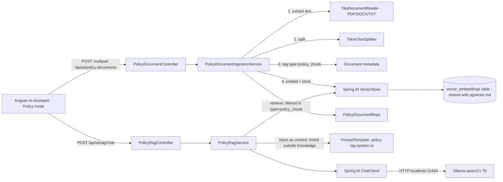

# Retrieval-Augmented Generation (RAG) Guide

## 1. Overview

This document explains the Retrieval-Augmented Generation feature - the sixth AI capability in
this application, alongside Spring AI chat (`doc/spring_ai.md`), Spring AI function calling
(`doc/function_calling.md`), LangChain4j (`doc/langchain4j.md`), the Employee AI Agent
(`doc/agent.md`), and pgvector semantic search (`doc/pgvector.md`).

It lets you upload PDF, DOCX, or TXT policy documents and ask questions that are answered
**only** from what was uploaded - not from the model's general knowledge.

| Endpoint | Method | Purpose |
|---|---|---|
| `/api/ai/policy-documents` | `POST` (multipart) | Upload a PDF/DOCX/TXT file with a category; extracts, chunks, embeds, and stores it |
| `/api/ai/policy-documents` | `GET` | List uploaded documents |
| `/api/ai/rag/chat` | `POST` | Ask a question - answered only from uploaded policy content |

Supported categories (validated, exact match): **Company Policy**, **HR Handbook**, **Leave
Policy**, **Insurance Policy**.

No existing endpoint, entity, or Angular component was changed to build this - it is entirely
additive, in a new `com.practices.ai.rag` package and a new `PolicyDocument` entity.

## 2. What was reused vs. what's new

Per the explicit instruction to skip anything already implemented, this feature deliberately
reuses as much of `doc/pgvector.md`'s infrastructure as possible rather than building a second
copy:

| Already built (reused as-is) | Newly built for RAG |
|---|---|
| The `VectorStore` bean (`PgVectorStore`) | File upload endpoint (multipart) |
| The `vector_embeddings` pgvector table | Text extraction (Apache Tika) |
| The embedding model (`TransformersEmbeddingModel`, ONNX, 384-dim) | Chunking (`TokenTextSplitter`) |
| `ChatClient` / `AiProperties` / `ConversationMemory` beans | Category validation and tracking (`PolicyDocument` entity) |
| The `OllamaChatOptions` think-toggle pattern from `AIService` | Strict "answer only from context" retrieval + prompt |

No new vector store, no new embedding model, no new chat client - one shared pgvector table
now holds three kinds of content (`employee`, `document`, `policy_chunk`), distinguished purely
by a `type` metadata field.

## 3. High-level architecture



## 4. Package structure

```text
com.practices.ai.rag
├── PolicyDocumentIngestionService.java   Upload -> extract -> split -> embed -> store
├── PolicyRagService.java                 Retrieve -> inject -> strictly-grounded answer
├── dto/
│   └── PolicyDocumentResponse.java       Upload/list response shape
└── controller/
    ├── PolicyDocumentController.java         /api/ai/policy-documents
    ├── PolicyRagController.java              /api/ai/rag/chat
    └── RagExceptionHandler.java              Scoped exception handling for both controllers
```

New entity and repository (outside the `ai` package, alongside `Employee`/`KnowledgeDocument`):

```text
com.practices.entity.PolicyDocument
com.practices.repository.PolicyDocumentRepo
```

`PolicyDocument` tracks only upload **metadata** - `filename`, `category`, `chunkCount`,
`uploadedAt` - not the raw file bytes and not the extracted text. The actual searchable content
lives entirely in `vector_embeddings`, split across chunks. This was a deliberate choice: there
was no requirement to download the original file later, so storing it would only add
unnecessary disk/security surface for no requested benefit.

## 5. Maven and configuration

One new starter - `spring-ai-tika-document-reader` - already covered by the existing
`spring-ai-bom` import, no new version property needed. `TokenTextSplitter` required no new
dependency at all; it was already transitively present in `spring-ai-commons` from earlier
work.

```xml
<dependency>
    <groupId>org.springframework.ai</groupId>
    <artifactId>spring-ai-tika-document-reader</artifactId>
</dependency>
```

`application.properties`:

```properties
# RAG document upload (PDF/DOCX/TXT) - default Spring Boot limit is 1MB, too small for real policy files
spring.servlet.multipart.max-file-size=20MB
spring.servlet.multipart.max-request-size=20MB
```

Spring Boot's default multipart limit is 1MB per file - too small for a realistic policy PDF.
Raised to 20MB; this is the only property this feature needed to add, since embedding model
selection (`spring.ai.model.embedding=transformers`) and the pgvector table config were already
set up in `doc/pgvector.md`.

## 6. Upload pipeline - `PolicyDocumentIngestionService`

File: `src/main/java/com/practices/ai/rag/PolicyDocumentIngestionService.java`

### 6.1 Validation before doing any work

```java
String extension = extensionOf(filename);
if (!ALLOWED_EXTENSIONS.contains(extension)) {
    throw new IllegalArgumentException("Unsupported file type - only PDF, DOCX, and TXT are allowed.");
}
if (category == null || !ALLOWED_CATEGORIES.contains(category)) {
    throw new IllegalArgumentException("Category must be one of: " + String.join(", ", ALLOWED_CATEGORIES));
}
```

Extension check and exact-match category check both happen before any file parsing - a bad
request fails fast with a clear `400`, not a confusing downstream Tika error.

### 6.2 Extraction - one reader for all three formats

```java
private List<Document> extractText(MultipartFile file, String filename) {
    byte[] bytes = file.getBytes();
    ByteArrayResource resource = new ByteArrayResource(bytes) {
        @Override
        public String getFilename() {
            return filename;
        }
    };
    return new TikaDocumentReader(resource).get();
}
```

`TikaDocumentReader` wraps Apache Tika's `AutoDetectParser`, which sniffs the actual file format
from content (not just the extension) and extracts plain text - the same reader class handles
PDF, DOCX, and TXT without any format-specific branching. The anonymous `ByteArrayResource`
subclass exists only to give Tika a filename hint (`ByteArrayResource` doesn't carry one by
default), which helps its format detection.

After extraction, a defensive check rejects files with no readable text (e.g. a scanned image
PDF with no text layer) rather than silently indexing empty chunks:

```java
boolean hasReadableText = extracted.stream()
        .anyMatch(document -> document.getText() != null && !document.getText().isBlank());
if (!hasReadableText) {
    throw new IllegalArgumentException("No readable text could be extracted from this file.");
}
```

### 6.3 Tagging before splitting, not after

Metadata (`type`, `policyDocumentId`, `filename`, `category`) is set on the Tika-extracted
`Document` **before** splitting:

```java
for (Document document : extracted) {
    document.getMetadata().put("type", TYPE_POLICY_CHUNK);
    document.getMetadata().put("policyDocumentId", policyDocument.getId());
    document.getMetadata().put("filename", filename);
    document.getMetadata().put("category", category);
}
List<Document> chunks = textSplitter.apply(extracted);
```

Spring AI's `TextSplitter` copies each source document's metadata onto every chunk it produces,
so every resulting chunk - not just the first - carries the correct `policyDocumentId`,
`filename`, and `category`. Tagging after splitting would have required looping over every
chunk individually with no guarantee of getting the mapping back to the right source file.

### 6.4 Deterministic chunk ids, same reasoning as `pgvector.md` §7.1

```java
private String deterministicChunkId(Long policyDocumentId, int index) {
    return UUID.nameUUIDFromBytes(("policy-chunk-" + policyDocumentId + "-" + index).getBytes(StandardCharsets.UTF_8))
            .toString();
}
```

`PgVectorStore` requires document ids to be valid UUIDs (see `doc/pgvector.md` §7.1 for the
exact error this produces otherwise) - the same fix applies here: derive a UUID from a stable
logical key (`policyDocumentId` + chunk index) rather than using a random or plain-string id.

### 6.5 Chunk count is written twice

```java
PolicyDocument policyDocument = new PolicyDocument();
...
policyDocument.setChunkCount(0);
policyDocument = policyDocumentRepo.save(policyDocument);   // first save - get a generated id

... // tag metadata with policyDocument.getId(), split, embed

policyDocument.setChunkCount(taggedChunks.size());
policyDocument = policyDocumentRepo.save(policyDocument);   // second save - record the real count
```

The row is saved once early to obtain a generated id (needed to tag chunks and to build
deterministic chunk ids), and again at the end once the real chunk count is known. This is a
small, intentional two-phase write, not a bug.

## 7. Retrieval and strict grounding - `PolicyRagService`

File: `src/main/java/com/practices/ai/rag/PolicyRagService.java`

### 7.1 Retrieval is scoped to policy chunks only

```java
List<Document> matches = vectorStore.similaritySearch(SearchRequest.builder()
        .query(message)
        .topK(TOP_K)
        .filterExpression(new FilterExpressionBuilder()
                .eq("type", PolicyDocumentIngestionService.TYPE_POLICY_CHUNK)
                .build())
        .build());
```

The same `filterExpression` mechanism used in `doc/pgvector.md` §7.2 (there, to delete-then-rebuild
by type) is used here to retrieve by type - employee and free-text `KnowledgeDocument` embeddings
in the same table are invisible to this query. A question about an employee's skills cannot
accidentally get answered from policy text, and vice versa.

### 7.2 No matches -> no model call at all

```java
if (matches.isEmpty()) {
    String answer = "The uploaded policy documents don't cover that - either nothing has been "
            + "uploaded yet, or nothing relevant to your question was found.";
    memory.append(conversationId, new ChatMessage(Role.ASSISTANT, answer, now));
    return new ChatResponse(conversationId, answer, MODEL_LABEL, now);
}
```

If the vector store has zero `policy_chunk` rows (nothing uploaded yet) or the search genuinely
returns nothing, the service never calls the LLM at all - it's faster, and it removes any
possibility of the model improvising an answer when there's nothing to ground it in.

### 7.3 The prompt is the actual enforcement mechanism

File: `src/main/resources/prompts/policy-rag-system.st`

```text
You are a policy assistant. Answer the user's question using ONLY the context excerpts below, taken
from uploaded company policy documents. Do not use any outside knowledge, and do not guess.

If the context does not contain the answer, say plainly that the uploaded documents do not cover that
question - do not attempt to answer from general knowledge.
```

When matches *are* found but don't actually answer the question, enforcement is the model's
job, not Java's - there's no way to programmatically verify "did the model only use the
provided context." This was verified experimentally, not just assumed: asking *"What is the
capital of France?"* against a vector store that had real Leave/Insurance/Company policy
chunks in it (so retrieval was non-empty and the empty-matches short-circuit in §7.2 did **not**
fire) correctly returned *"The uploaded documents do not cover that question."* - confirming the
model, not just the Java guard, is honoring the instruction.

The prompt also carries forward the same anti-leakage rules already hardened in
`employee-assistant-system.st` after real bugs found during `doc/function_calling.md`'s
development (no `**markdown**`, no `"Assistant:"` prefix, no `Summary/Action/Notes` labels) -
reused proactively here rather than waiting to rediscover the same failure modes.

### 7.4 Context is built with source attribution

```java
private String renderContext(List<Document> matches) {
    StringBuilder sb = new StringBuilder();
    int index = 1;
    for (Document document : matches) {
        Object category = document.getMetadata().get("category");
        Object filename = document.getMetadata().get("filename");
        sb.append(index++).append(". [").append(category).append(" - ").append(filename).append("]\n")
                .append(document.getText()).append("\n\n");
    }
    return sb.toString();
}
```

Each retrieved chunk is labeled with its category and filename before being injected - this is
what lets the model (per the prompt's instruction) mention which document an answer came from,
as seen in the verified example *"According to the Leave Policy, employees are entitled to..."*.

### 7.5 Everything else is a deliberate copy of an established, working pattern

- `stripAssistantPrefix(...)` - identical defensive cleanup to `AIService`'s, for the same
  reason (small models occasionally echo the `User:`/`Assistant:` turn format from history back
  into their own output).
- `OllamaChatOptions.builder().model(aiProperties.defaultModel())...` - explicit model
  selection, avoiding the `"mistral"` SDK-default fallback bug documented and fixed in
  `doc/agent.md` §10.
- Reuses the existing `ConversationMemory` bean and `employee-assistant-user.st` template rather
  than introducing new ones for a single `{message}` substitution.
- Reuses the existing `ChatRequest`/`ChatResponse` DTOs (same shape LangChain4j's controller
  already reuses) rather than inventing RAG-specific request/response types.

## 8. Verified behavior

Tested against the real database, the real ONNX embedding model, and the real local Ollama
model - not mocked:

| Test | Result |
|---|---|
| Upload `leave-policy.txt` | `{"id":1,"filename":"leave-policy.txt","category":"Leave Policy","chunkCount":1,...}` |
| Upload `insurance-policy.pdf` (generated with real PDF structure via `reportlab`) | Parsed and embedded successfully - confirms Tika's PDF path works, not just plain text |
| Upload `company-policy.docx` (generated via `python-docx`) | Parsed and embedded successfully - confirms Tika's DOCX path works |
| "How many days of sick leave do I get, and do I need a medical certificate?" | *"According to the Leave Policy, employees are entitled to 10 days of paid sick leave per year. A medical certificate is required for sick leave exceeding 3 consecutive days."* - exact figures, correct source cited |
| "What is the annual insurance coverage limit per family, and how many days do I have to file a claim?" | *"...500,000 rupees...within 60 days..."* - answered correctly from the PDF specifically |
| "How many days per week can I work remotely, and what are the standard working hours?" | *"...up to 3 days per week...9:30 AM to 6:30 PM..."* - answered correctly from the DOCX specifically |
| "What is the capital of France?" (off-topic, asked while real policy chunks existed in the store) | *"The uploaded documents do not cover that question."* - confirms model-level grounding, not just the empty-store guard |
| Upload a `.exe` file | `400` - *"Unsupported file type - only PDF, DOCX, and TXT are allowed."* |
| Upload with an invalid category (`"Random Category"`) | `400` - *"Category must be one of: ..."* |
| A policy chunk surfacing in general Search mode | Correctly titled `"Leave Policy - leave-policy.txt"` (the `SemanticSearchService` fix in §9), not `"Unknown"` |
| Full regression sweep - core CRUD, Spring AI, LangChain4j, Agent, Search | All rechecked working and unaffected after this feature was added |
| Angular Policy mode (Playwright) | File upload form (file picker + category dropdown) works end-to-end; a real chat question through the UI was answered correctly from an uploaded PDF, hitting `/api/ai/rag/chat` specifically |

## 9. A necessary fix in `SemanticSearchService`

File: `src/main/java/com/practices/ai/embedding/SemanticSearchService.java`

The general Search mode's `similaritySearch` call has no type filter, so a `policy_chunk`
result can legitimately surface there too. Before this fix, its title would have rendered as
`"Unknown"` (the `default` case of the existing type-to-title `switch`). Fixed by adding a case:

```java
case "policy_chunk" -> document.getMetadata().get("category") + " - " + document.getMetadata().get("filename");
```

and reading `referenceId` from `policyDocumentId` instead of the (absent, for this type)
`referenceId` key. Purely additive - the existing `employee`/`document` cases are unchanged.

## 10. Known limitations

- **No re-upload/versioning story.** Uploading the same file twice creates two independent
  `PolicyDocument` rows and two independent sets of chunks - there is no dedupe-by-filename or
  "replace the previous version" behavior.
- **No delete endpoint.** `POST` (upload) and `GET` (list) exist; removing an uploaded document
  and its chunks was not requested and isn't implemented. A future addition would filter-delete
  by `policyDocumentId` metadata, the same mechanism `EmbeddingIngestionService` already uses
  for type-based delete-then-rebuild (`doc/pgvector.md` §7.2).
- **No raw file retention** (§4) - only extracted text (as chunks) and upload metadata are
  kept. This was a deliberate scope decision, not an oversight; revisit if "download the
  original file" ever becomes a requirement.
- **Scanned/image-only PDFs will be rejected** by the "no readable text extracted" check (§6.2)
  - Tika's default configuration here does not perform OCR.
- **Same RAG staleness family as `doc/pgvector.md` §11** - once uploaded, a document's chunks
  don't change unless re-uploaded; there is currently no "edit this document's content" flow.

## 11. Security considerations

In addition to the general notes in the other AI docs:

- `POST /api/ai/policy-documents` has no authentication - anyone who can reach the API can
  upload content that becomes part of what the RAG assistant treats as ground truth. Treat this
  the same as the other currently-unauthenticated write endpoints in this app (`doc/spring_ai.md`
  §24) and add access control before production use.
- Uploaded file content is parsed by Apache Tika, which has historically had CVEs in some of
  its many format parsers. Keep the `spring-ai-tika-document-reader` (and its transitive Tika
  dependency) up to date, and treat "PDF/DOCX/TXT only" as a defense-in-depth measure, not a
  complete guarantee against a malicious file.
- `spring.servlet.multipart.max-file-size=20MB` bounds a single upload's size but does not rate
  limit repeated uploads - a large number of uploads could grow `vector_embeddings` without
  bound. No cleanup/retention policy exists today.
- The strict-grounding prompt (§7.3) is a **behavioral** control, not a technical one - a
  sufficiently adversarial question (prompt injection embedded in an uploaded document's text,
  for instance) is not defended against beyond what the base model itself resists.

## 12. File reference

| File | Responsibility |
|---|---|
| `pom.xml` | `spring-ai-tika-document-reader` |
| `application.properties` | Multipart upload size limits |
| `entity/PolicyDocument.java` | Upload metadata (filename, category, chunk count, timestamp) - not raw content |
| `repository/PolicyDocumentRepo.java` | Plain `JpaRepository` for policy document metadata |
| `ai/rag/PolicyDocumentIngestionService.java` | Upload validation, Tika extraction, splitting, tagging, embedding |
| `ai/rag/PolicyRagService.java` | Scoped retrieval, strict-grounding prompt, canned empty-result response |
| `ai/rag/dto/PolicyDocumentResponse.java` | Upload/list response shape |
| `ai/rag/controller/PolicyDocumentController.java` | `/api/ai/policy-documents` (upload, list) |
| `ai/rag/controller/PolicyRagController.java` | `/api/ai/rag/chat` |
| `ai/rag/controller/RagExceptionHandler.java` | Scoped exception handling, mirrors `AiExceptionHandler` |
| `ai/embedding/SemanticSearchService.java` | Extended (not replaced) to label `policy_chunk` results correctly in general Search |
| `prompts/policy-rag-system.st` | The strict-grounding system prompt |
| Angular `ai/components/ai-panel/` | "Policy" provider mode, file upload form (file picker + category dropdown), chat rendering |

No other file was modified to implement this feature.

## 13. Architectural rules

1. RAG source content is always tagged `type=policy_chunk` in `vector_embeddings` - never mixed
   into the `employee` or `document` type namespaces, and never given its own separate vector
   store.
2. `PolicyRagService` must always scope retrieval with a `type=policy_chunk` filter - broadening
   it to unfiltered search would defeat the "answer only from uploaded documents" requirement by
   letting employee data leak into policy answers.
3. Metadata must be set on the source `Document` *before* splitting, not chunk-by-chunk after,
   so every chunk reliably inherits `policyDocumentId`/`filename`/`category`.
4. New action here follows the same "confirm success only after real completion" discipline as
   `PolicyDocumentIngestionService.upload()` - the response's `chunkCount` reflects what was
   actually embedded, not an assumed count.
5. The strict-grounding prompt (`policy-rag-system.st`) must not be relaxed to "prefer the
   context but allow general knowledge" - that would silently defeat the entire feature's
   purpose. Any future change to this prompt should be re-verified with an off-topic question
   the same way §7.3 and §8 were.
6. This feature must not change the request/response contracts of `/api/ai/chat`,
   `/api/ai/langchain/*`, `/api/ai/agent/*`, `/api/ai/semantic-search`, or any `/employee/*`
   endpoint - it is additive only, under `/api/ai/policy-documents` and `/api/ai/rag/*`.
