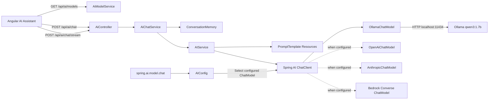
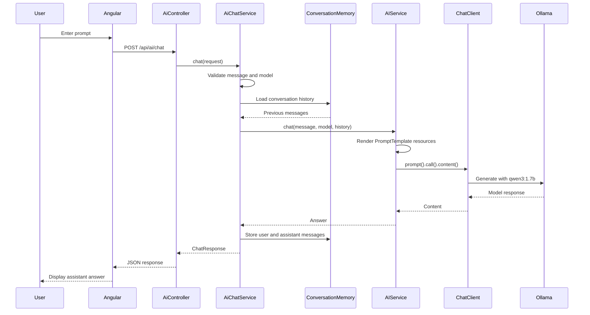

# Spring AI Integration Guide

## 1. Overview

This document explains the Spring AI integration inside the Employee CRUD application.
The implementation uses Spring AI `2.0.0` with Spring Boot `4.1.0` and Java 21.

The AI module is isolated under:

```text
src/main/java/com/practices/ai
```

All AI HTTP endpoints remain under:

```text
/api/ai/*
```

Existing Employee CRUD controllers and endpoint contracts are unchanged.

Current provider behavior:

- Ollama is the default active provider.
- Local model: `qwen3:1.7b`.
- ChatGPT is displayed but disabled.
- Gemini is displayed but disabled.
- Claude is displayed but disabled.
- Amazon Bedrock is displayed but disabled.

## 2. Features implemented

- Spring AI 2.0.0 BOM dependency management.
- Official Spring AI Ollama starter.
- Official Spring AI OpenAI starter.
- Official Spring AI Anthropic starter for Claude.
- Official Spring AI Amazon Bedrock Converse starter.
- Configuration-driven provider selection.
- Explicit `AIConfig` configuration class.
- One application `ChatClient` bean.
- `AIService` for synchronous and streaming generation.
- Spring AI `PromptTemplate` resources.
- Existing backend conversation memory integration.
- Synchronous chat endpoint.
- Server-Sent Events streaming endpoint.
- Ollama thinking disabled for faster local responses.
- Bounded Ollama response generation.
- Existing Angular AI model selector compatibility.

## 3. High-level architecture



## 4. Maven configuration

Spring AI uses a Bill of Materials to keep all provider libraries on the same version.

The project declares:

```xml
<properties>
    <java.version>21</java.version>
    <spring-ai.version>2.0.0</spring-ai.version>
</properties>
```

Spring AI BOM:

```xml
<dependencyManagement>
    <dependencies>
        <dependency>
            <groupId>org.springframework.ai</groupId>
            <artifactId>spring-ai-bom</artifactId>
            <version>${spring-ai.version}</version>
            <type>pom</type>
            <scope>import</scope>
        </dependency>
    </dependencies>
</dependencyManagement>
```

Provider starters:

```xml
<dependency>
    <groupId>org.springframework.ai</groupId>
    <artifactId>spring-ai-starter-model-ollama</artifactId>
</dependency>

<dependency>
    <groupId>org.springframework.ai</groupId>
    <artifactId>spring-ai-starter-model-openai</artifactId>
</dependency>

<dependency>
    <groupId>org.springframework.ai</groupId>
    <artifactId>spring-ai-starter-model-anthropic</artifactId>
</dependency>

<dependency>
    <groupId>org.springframework.ai</groupId>
    <artifactId>spring-ai-starter-model-bedrock-converse</artifactId>
</dependency>
```

No version is placed directly on these dependencies because the Spring AI BOM manages it.

## 5. Provider selection

The active Spring AI provider is controlled by:

```properties
spring.ai.model.chat=${AI_PROVIDER:ollama}
```

Supported values in `AIConfig`:

| Value | Spring bean | Provider |
|---|---|---|
| `ollama` | `ollamaChatModel` | Local Ollama |
| `openai` | `openAiChatModel` | OpenAI |
| `anthropic` | `anthropicChatModel` | Anthropic Claude |
| `bedrock-converse` | `bedrockProxyChatModel` | Amazon Bedrock Converse |

If `AI_PROVIDER` is not defined, Ollama is selected.

Example PowerShell provider selection:

```powershell
$env:AI_PROVIDER="ollama"
```

Changing a provider requires restarting Spring Boot because the `ChatClient` bean is created
during application startup.

## 6. `AIConfig`

File:

```text
src/main/java/com/practices/ai/config/AIConfig.java
```

Purpose:

1. Receives all `ChatModel` beans created by Spring AI auto-configuration.
2. Reads `spring.ai.model.chat`.
3. Maps the provider name to the correct Spring bean name.
4. Validates that the provider is supported.
5. Validates that the provider's `ChatModel` exists.
6. Creates one application `ChatClient` bean.

The explicit bean-name resolution prevents this startup error:

```text
required a single bean, but 4 were found
```

Without explicit selection, Spring cannot decide between Ollama, OpenAI, Anthropic, and
Bedrock `ChatModel` beans.

Conceptual implementation:

```java
@Bean
ChatClient chatClient(
        Map<String, ChatModel> chatModels,
        @Value("${spring.ai.model.chat:ollama}") String provider) {
    String beanName = PROVIDER_BEANS.get(provider);
    ChatModel selectedModel = chatModels.get(beanName);
    return ChatClient.builder(selectedModel).build();
}
```

Unsupported provider names fail during startup with a clear error instead of selecting an
unexpected model.

## 7. Ollama configuration

Current default configuration:

```properties
spring.ai.model.chat=${AI_PROVIDER:ollama}
spring.ai.ollama.base-url=${OLLAMA_BASE_URL:http://localhost:11434}
spring.ai.ollama.chat.model=${OLLAMA_MODEL:qwen3:1.7b}
spring.ai.ollama.chat.temperature=${OLLAMA_TEMPERATURE:0.2}
spring.ai.ollama.chat.think=${OLLAMA_THINK:false}
spring.ai.ollama.chat.num-predict=${OLLAMA_NUM_PREDICT:256}
```

Meaning:

- `base-url`: local Ollama server address. Do not add `/v1` for the native Spring AI Ollama
  starter.
- `model`: installed Ollama model name.
- `temperature`: controls answer variation.
- `think=false`: prevents Qwen3 from spending excessive time generating a reasoning trace.
- `num-predict=256`: limits the maximum generated output tokens for responsive local chat.

Verify Ollama:

```powershell
ollama list
```

Expected entry:

```text
qwen3:1.7b
```

Start Ollama when necessary:

```powershell
ollama serve
```

Check the Ollama API:

```powershell
Invoke-RestMethod http://localhost:11434/api/tags
```

Override local defaults:

```powershell
$env:OLLAMA_BASE_URL="http://localhost:11434"
$env:OLLAMA_MODEL="qwen3:1.7b"
$env:OLLAMA_THINK="false"
$env:OLLAMA_NUM_PREDICT="256"
```

## 8. OpenAI configuration

Configuration placeholders:

```properties
spring.ai.openai.api-key=${OPENAI_API_KEY:not-configured}
spring.ai.openai.chat.model=${OPENAI_MODEL:gpt-4.1-mini}
```

To activate OpenAI in a future deployment:

```powershell
$env:AI_PROVIDER="openai"
$env:OPENAI_API_KEY="your-secret-key"
$env:OPENAI_MODEL="your-supported-model"
```

Then restart Spring Boot.

Never commit the actual API key to `application.properties`.

The current Angular model catalog intentionally keeps ChatGPT disabled. Activating the
backend alone does not automatically enable the Angular option; credential-aware model
discovery must be added to `AiModelService` first.

## 9. Anthropic Claude configuration

Configuration placeholders:

```properties
spring.ai.anthropic.api-key=${ANTHROPIC_API_KEY:not-configured}
spring.ai.anthropic.chat.model=${ANTHROPIC_MODEL:claude-haiku-4-5}
```

Future activation example:

```powershell
$env:AI_PROVIDER="anthropic"
$env:ANTHROPIC_API_KEY="your-secret-key"
$env:ANTHROPIC_MODEL="your-supported-claude-model"
```

Restart Spring Boot after changing the provider.

Claude remains disabled in the current Angular dropdown.

## 10. Amazon Bedrock configuration

Configuration placeholders:

```properties
spring.ai.bedrock.aws.region=${AWS_REGION:us-east-1}
spring.ai.bedrock.converse.chat.options.model=${BEDROCK_MODEL:us.anthropic.claude-haiku-4-5-20251001-v1:0}
```

Future activation example:

```powershell
$env:AI_PROVIDER="bedrock-converse"
$env:AWS_REGION="us-east-1"
$env:AWS_ACCESS_KEY_ID="your-access-key"
$env:AWS_SECRET_ACCESS_KEY="your-secret-key"
$env:BEDROCK_MODEL="your-enabled-bedrock-model-id"
```

AWS can also use its normal credential-provider chain, such as an AWS profile or instance
role. The selected model must be enabled for the AWS account and region.

Bedrock remains disabled in the current Angular dropdown.

## 11. Gemini status

Gemini appears in the model dropdown as a disabled future provider. The current Spring AI
integration does not include a Google Gemini starter or active Gemini credentials.

To implement Gemini later:

1. Add the official Spring AI Google GenAI starter compatible with the chosen Spring AI
   release.
2. Add Google credentials using environment variables or workload identity.
3. Add its `ChatModel` bean mapping to `AIConfig`.
4. Update `AiModelService` to mark Gemini available only when configured.
5. Add integration and streaming tests.

## 12. `AIService`

File:

```text
src/main/java/com/practices/ai/service/AIService.java
```

Responsibilities:

- Uses the application `ChatClient`.
- Loads prompt templates from classpath resources.
- Renders conversation history into the system prompt.
- Renders the user message into the user prompt.
- Sets the requested model through portable `ChatOptions`.
- Supports synchronous responses.
- Supports reactive streaming through Reactor `Flux<String>`.

Synchronous method:

```java
public String chat(String message, String model, List<ChatMessage> history) {
    return request(message, model, history).call().content();
}
```

Streaming method:

```java
public Flux<String> stream(String message, String model, List<ChatMessage> history) {
    return request(message, model, history).stream().content();
}
```

The provider-specific implementation is hidden behind Spring AI's `ChatClient` and
`ChatModel` abstractions.

## 13. Prompt templates

Prompt directory:

```text
src/main/resources/prompts
```

### System prompt

File:

```text
employee-assistant-system.st
```

Purpose:

- Defines assistant behavior.
- Protects employee information.
- Prevents invented employee records.
- Requests clear uncertainty statements.
- Includes prior conversation history through `{history}`.

### User prompt

File:

```text
employee-assistant-user.st
```

Template:

```text
{message}
```

Spring AI `PromptTemplate` replaces these variables at runtime.

Benefits of resource-based templates:

- Prompts are separated from Java orchestration code.
- Prompt changes do not require rewriting service logic.
- Templates can be versioned and reviewed independently.
- Provider code remains reusable.

## 14. `AiChatService`

File:

```text
src/main/java/com/practices/ai/service/AiChatService.java
```

`AiChatService` remains the application use-case layer around Spring AI.

Responsibilities:

- Validates requests.
- Rejects blank messages.
- Limits messages to 8,000 characters.
- Generates conversation IDs.
- Selects the configured default model when none is provided.
- Retrieves existing conversation history.
- Delegates generation to `AIService`.
- Stores successful user and assistant messages.

This keeps HTTP, validation, memory, and model-generation concerns separated.

## 15. Conversation memory

The existing `ConversationMemory` abstraction remains in use.

Current implementation:

```text
InMemoryConversationMemory
```

Behavior:

- Stores messages by conversation ID.
- Uses thread-safe data structures.
- Limits retained messages per conversation.
- Loses history when the backend restarts.
- Does not share history between multiple backend instances.

For production scaling, replace it with Redis or PostgreSQL while keeping the
`ConversationMemory` interface.

## 16. Synchronous chat endpoint

Endpoint:

```http
POST /api/ai/chat
Content-Type: application/json
```

Request:

```json
{
  "conversationId": null,
  "message": "Hello",
  "model": "qwen3:1.7b"
}
```

Response:

```json
{
  "conversationId": "generated-uuid",
  "message": "Hello! How can I help?",
  "model": "qwen3:1.7b",
  "createdAt": "2026-07-04T15:00:00Z"
}
```

The existing Angular chat currently uses this endpoint.

PowerShell test:

```powershell
$body = @{
    message = "Say hello"
    model = "qwen3:1.7b"
} | ConvertTo-Json

Invoke-RestMethod `
    -Method Post `
    -Uri "http://localhost:8080/api/ai/chat" `
    -ContentType "application/json" `
    -Body $body
```

## 17. Streaming chat endpoint

Endpoint:

```http
POST /api/ai/chat/stream
Content-Type: application/json
Accept: text/event-stream
```

The endpoint returns:

```text
Flux<String>
```

Controller mapping:

```java
@PostMapping(value = "/chat/stream", produces = MediaType.TEXT_EVENT_STREAM_VALUE)
public Flux<String> stream(@RequestBody ChatRequest request) {
    return chatService.stream(request);
}
```

Streaming flow:

1. Validate the chat request.
2. Load conversation history.
3. Render templates.
4. Call `ChatClient.stream().content()`.
5. Send generated chunks through SSE.
6. Accumulate chunks on the backend.
7. Store the complete assistant response when streaming finishes.

Example with curl:

```bash
curl -N -X POST http://localhost:8080/api/ai/chat/stream \
  -H "Content-Type: application/json" \
  -H "Accept: text/event-stream" \
  -d '{"message":"Explain Spring AI briefly","model":"qwen3:1.7b"}'
```

The Angular UI does not yet consume this endpoint. It can be adopted later using `fetch`
stream reading or an SSE-compatible POST client.

## 18. Model catalog endpoint

Endpoint:

```http
GET /api/ai/models
```

Current response concept:

```json
[
  {
    "id": "qwen3:1.7b",
    "displayName": "Ollama: qwen3:1.7b",
    "provider": "Ollama",
    "available": true
  },
  {
    "id": "gpt-4.1-mini",
    "displayName": "ChatGPT (not configured)",
    "provider": "OpenAI",
    "available": false
  },
  {
    "id": "gemini",
    "displayName": "Gemini (not configured)",
    "provider": "Google",
    "available": false
  },
  {
    "id": "claude",
    "displayName": "Claude (not configured)",
    "provider": "Anthropic",
    "available": false
  },
  {
    "id": "bedrock",
    "displayName": "Bedrock (not configured)",
    "provider": "AWS",
    "available": false
  }
]
```

Angular selects the first model with `available=true` and disables the remaining options.

## 19. Search endpoint

The existing AI search endpoint remains available:

```http
GET /api/ai/search?query=engineering
```

It uses `EmployeeSearchTool` and the existing Employee repository. It is separate from
Spring AI chat generation and does not change CRUD endpoint behavior.

## 20. Complete request flow



## 21. Running the application

### Start Ollama

```powershell
ollama serve
```

If Ollama is already running as a Windows service or background application, starting it
again is unnecessary.

### Start PostgreSQL

Ensure the existing `emp_db` database is reachable using the application's datasource
configuration.

### Start Spring Boot

```powershell
cd G:\practise\back_end\java\source_code\employee_crud_app
.\mvnw.cmd spring-boot:run
```

### Start Angular

```powershell
cd G:\practise\front_end\angular\employee-ui
npm start
```

Open the Angular application, enable the AI toggle, and verify that
`Ollama: qwen3:1.7b` is selected.

## 22. Build and verification

Backend tests:

```powershell
.\mvnw.cmd test
```

Backend package:

```powershell
.\mvnw.cmd package -DskipTests
```

Frontend production build:

```powershell
npm run build
```

Verified behavior during implementation:

- Ollama API was reachable on port `11434`.
- `qwen3:1.7b` was installed.
- Spring Boot application context started successfully.
- `/api/ai/models` returned Ollama enabled.
- ChatGPT, Gemini, Claude, and Bedrock returned disabled.
- `/api/ai/chat` returned an actual response from local Ollama.
- Maven tests completed successfully.

## 23. Troubleshooting

### Multiple `ChatModel` beans found

Error:

```text
required a single bean, but 4 were found
```

Cause:

All four Spring AI starters created a `ChatModel`, but the application attempted to inject a
single unqualified `ChatModel`.

Fix already implemented:

`AIConfig` receives `Map<String, ChatModel>` and explicitly resolves the configured provider
bean.

### Angular shows `Local fallback`

This normally means `/api/ai/models` could not be loaded.

Check:

```text
http://localhost:8080/api/ai/models
```

Restart Spring Boot after backend configuration changes.

### Angular reports models unavailable

Confirm:

- Backend is running on port `8080`.
- Spring Boot started without an application-context error.
- Angular can access `/api/ai/models` through CORS.
- PostgreSQL startup did not prevent the backend from becoming ready.

### Ollama chat hangs or responds slowly

Confirm these settings are active:

```properties
spring.ai.ollama.chat.think=false
spring.ai.ollama.chat.num-predict=256
```

The first request may be slower because Ollama loads the model into memory.

Check Ollama status:

```powershell
ollama ps
ollama list
```

### Model not found

Install the configured model:

```powershell
ollama pull qwen3:1.7b
```

Ensure `OLLAMA_MODEL` and the model sent by Angular use the same identifier.

### OpenAI or Claude returns authentication errors

The cloud providers are not configured by default. Supply real credentials only through
environment variables and select the matching `AI_PROVIDER`.

### Bedrock access denied

Check:

- AWS credentials.
- AWS region.
- IAM permissions.
- Bedrock model access.
- The exact Bedrock inference model ID.

## 24. Security considerations

- Never commit OpenAI, Anthropic, or AWS credentials.
- Restrict CORS before public deployment.
- Authenticate and authorize `/api/ai/*`.
- Avoid sending employee personal data to cloud providers without approval.
- Add rate limiting and provider quotas.
- Do not log sensitive prompts or responses by default.
- Add conversation ownership before persistent memory is introduced.
- Validate model names instead of accepting unrestricted provider input.
- Use secret managers for production credentials.
- Add request timeouts, metrics, and tracing.

## 25. Production improvements

Recommended next steps:

1. Replace browser-only and in-memory chat history with persistent, user-owned sessions.
2. Add a streaming Angular client for `/api/ai/chat/stream`.
3. Return structured SSE events containing conversation ID, chunk, completion, and error
   event types.
4. Add provider health checks.
5. Replace static disabled model entries with credential-aware provider discovery.
6. Add circuit breakers and carefully bounded retry policies.
7. Add integration tests using mock AI servers.
8. Add observability for latency, token usage, errors, and provider selection.
9. Add authentication and authorization.
10. Add document ingestion and RAG behind the existing `ContextRetriever` abstraction.

## 26. File reference

| File | Responsibility |
|---|---|
| `pom.xml` | Spring AI BOM and provider starters |
| `application.properties` | Provider selection and provider settings |
| `ai/config/AIConfig.java` | Dynamic provider resolution and `ChatClient` bean |
| `ai/service/AIService.java` | Prompt rendering, synchronous chat, streaming chat |
| `ai/service/AiChatService.java` | Validation, conversation IDs, memory coordination |
| `ai/controller/AiController.java` | `/api/ai/chat` and `/api/ai/chat/stream` endpoints |
| `ai/service/AiModelService.java` | Enabled and disabled dropdown catalog |
| `ai/memory/ConversationMemory.java` | Memory abstraction |
| `ai/memory/InMemoryConversationMemory.java` | Current bounded in-memory history |
| `prompts/employee-assistant-system.st` | System prompt template |
| `prompts/employee-assistant-user.st` | User prompt template |

## 27. Architectural rules

1. Existing Employee CRUD endpoint contracts must remain unchanged.
2. All new AI endpoints must remain below `/api/ai/*`.
3. Controllers should delegate rather than contain provider logic.
4. Application services should depend on `ChatClient`, not provider HTTP APIs.
5. Secrets must come from environment variables or a secret manager.
6. Ollama remains the default until another provider is intentionally enabled.
7. Unconfigured providers remain visible but disabled in Angular.
8. Prompt templates remain in classpath resources.
9. Streaming and synchronous flows should share validation and prompt logic.
10. Provider changes must not affect Employee CRUD behavior.
